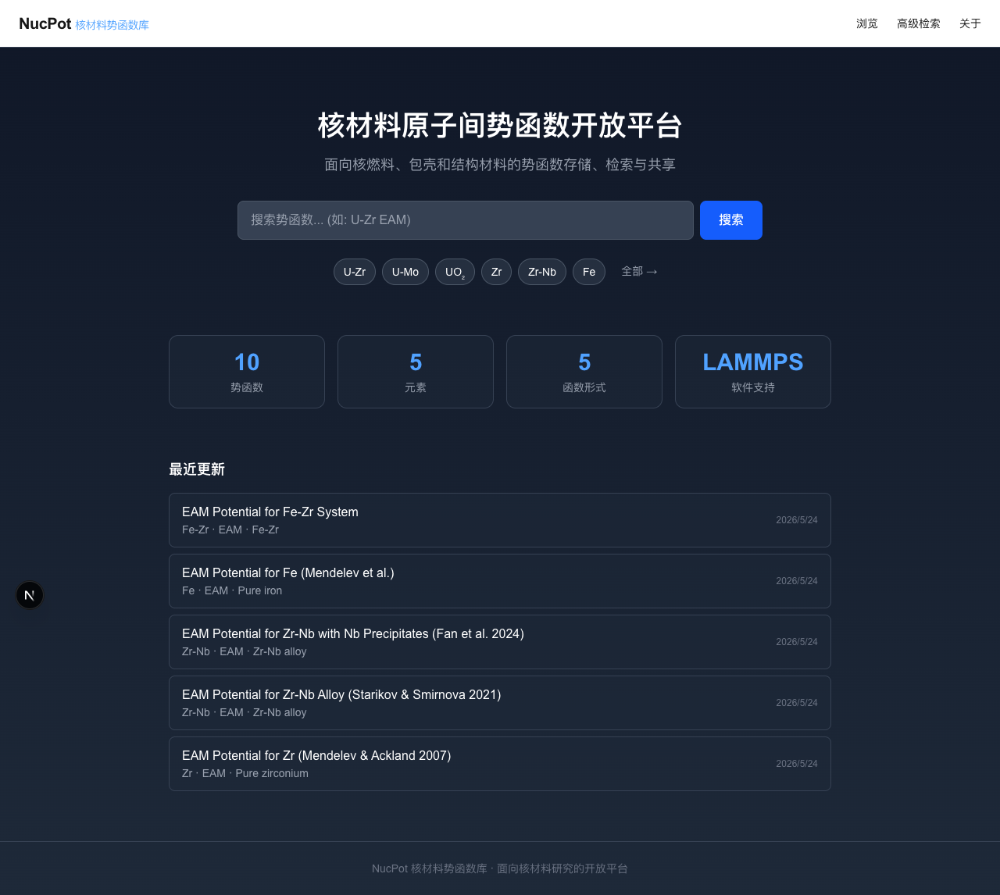
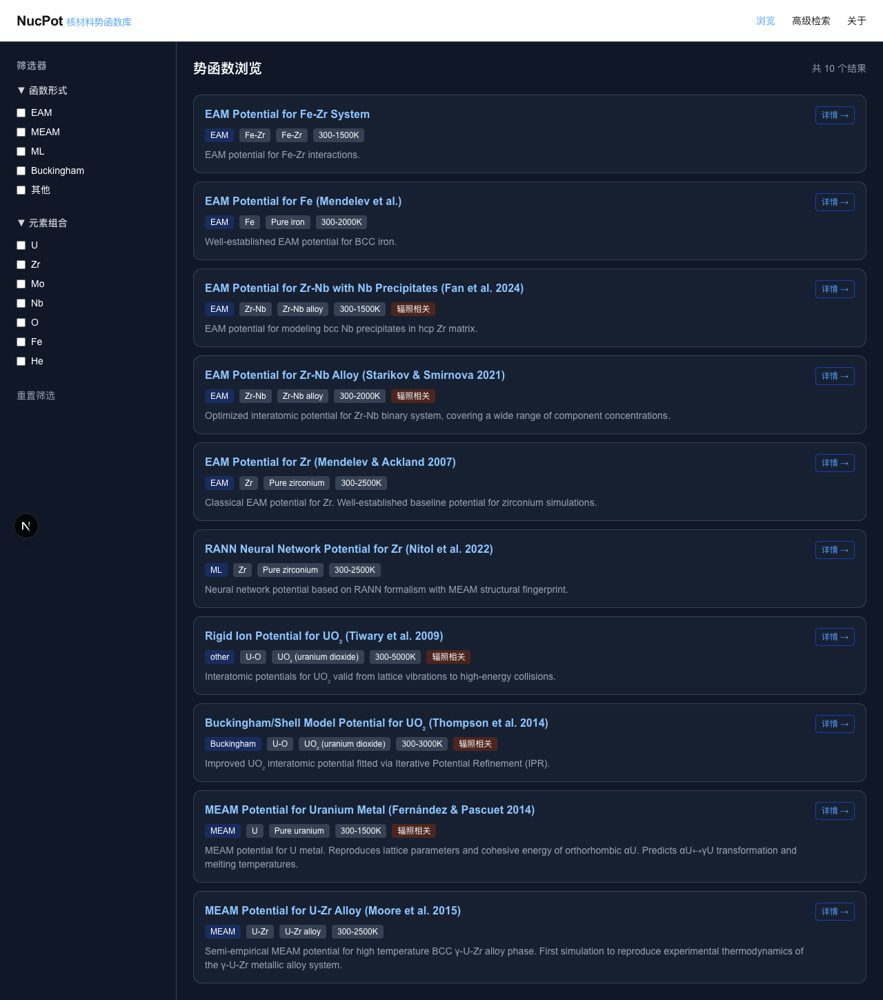
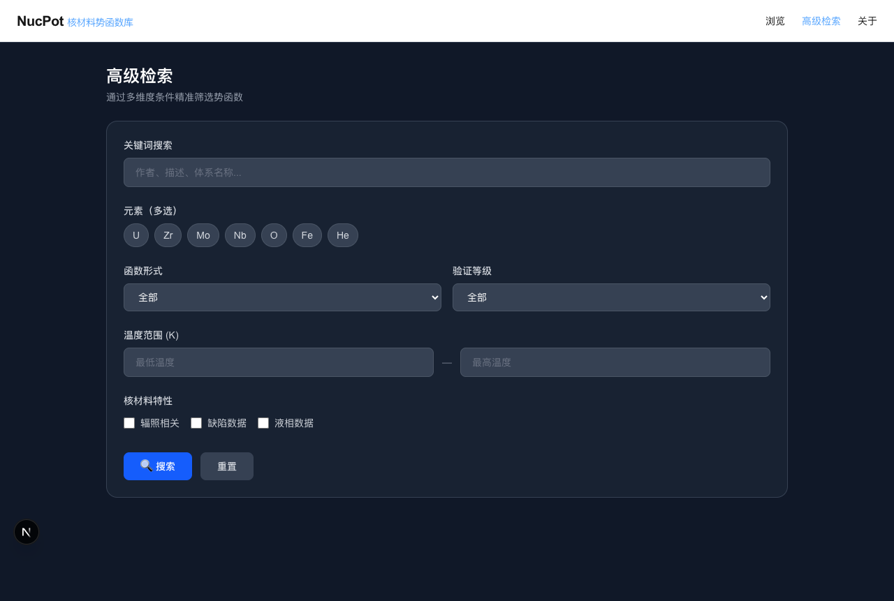
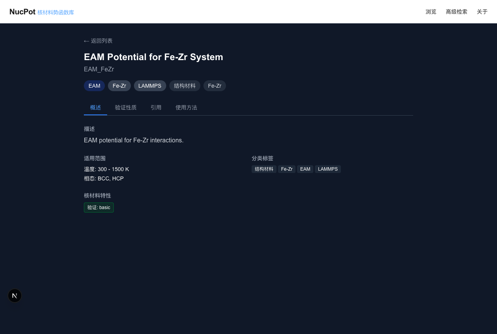
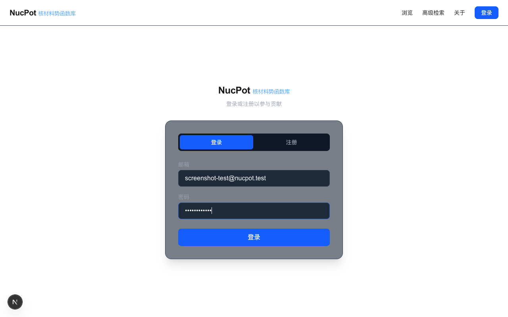
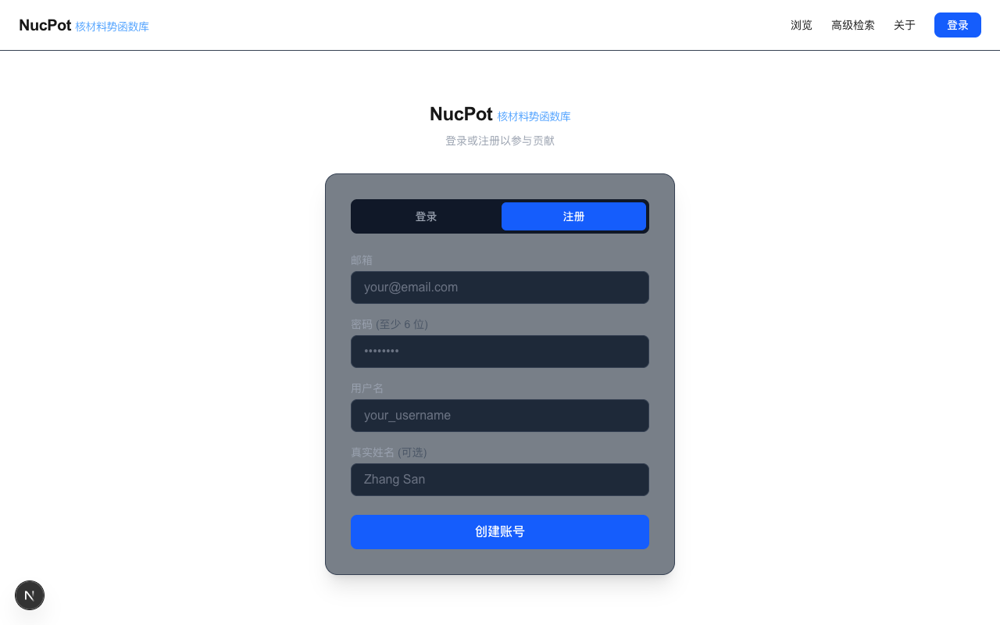
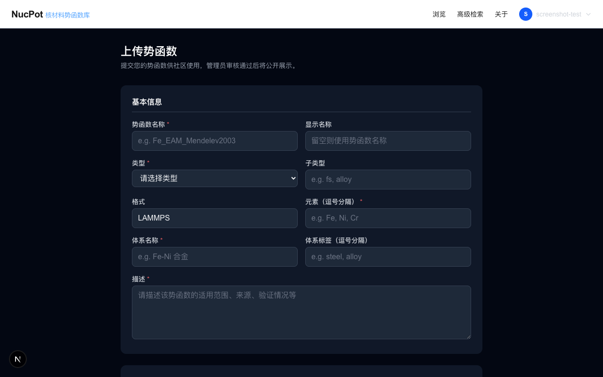
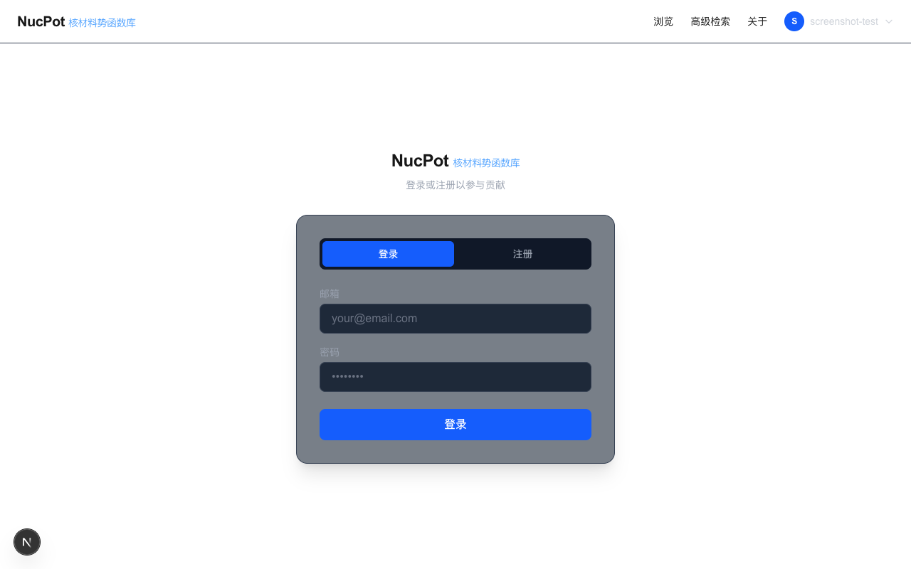

# NucPot - 核材料势函数库

[](https://nextjs.org/)
[](https://www.typescriptlang.org/)
[](https://supabase.com/)
[]()
[]()

**面向核燃料、包壳和结构材料的原子间势函数开放平台。**

NucPot 是一个面向核材料研究者的势函数存储、检索、验证与共享平台，旨在为国内核材料计算模拟提供可靠的势函数资源服务。平台集成了 LAMMPS 验证管道，可自动计算晶格常数、内聚能、弹性常数、体模量和空位形成能，并给出 A–F 等级评定。

## ✨ 功能特性

- **势函数浏览** — 卡片式列表，支持按类型、元素组合筛选
- **高级检索** — 元素组合 × 函数形式 × 温度范围 × 核材料专用标签
- **搜索建议** — 输入自动补全下拉，快速定位目标势函数
- **势函数详情** — 验证性质、引用信息、LAMMPS 命令一键复制、势函数版本字段
- **核材料差异化** — 辐照相关性、缺陷数据、液相数据等专属维度
- **LAMMPS 验证管道** — 自动化计算 5 项性质（晶格常数、内聚能、弹性常数、体模量、空位形成能），A–F 等级评定
- **验证报告** — 单项验证详情页，实时进度条，验证徽章展示
- **势函数比较** — 多势函数并排对比
- **文件上传** — Supabase Storage 势函数文件托管
- **NFMD 审核模块** — 参数审核 + 文献关联 + PDF 全文检索 + 批量操作（7 个 PostgreSQL RPC）
- **用户系统** — 注册/登录、个人主页、反馈入口
- **管理后台** — 统计概览、贡献审核、验证管理、参数审核、文献管理
- **安全** — Admin API 鉴权、verifyAdmin 共享模块、无 NEXT_PUBLIC_ 泄露密钥
- **50+ 势函数** — 覆盖 U-Zr、U、UO₂、Zr、Zr-Nb、Fe 等核材料体系

## 📊 覆盖的势函数

> 50+ 势函数，覆盖 15 种元素体系，数据来源于 [NIST IPR](https://www.ctcms.nist.gov/potentials/)、[OpenKIM](https://openkim.org/) 和 [ColabFit](https://colabfit.org/)。

| 体系 | 类型 | 来源 | 核心价值 |
|------|------|------|---------|
| U-Zr | MEAM | Moore 2015 | 金属燃料热力学 |
| U | MEAM | Fernández 2014 | 纯铀相变 |
| UO₂ | Buckingham | Thompson 2014 | 氧化物燃料缺陷+声子 |
| UO₂ | ZBL+库仑 | Tiwary 2009 | 全能量范围 |
| Zr | RANN (ML) | Nitol 2022 | 三相变预测 |
| Zr | EAM | Mendelev 2007 | 经典基线 |
| Zr-Nb | EAM | Starikov 2021 | 全浓度合金 |
| Zr-Nb | EAM | Fan 2024 | Nb 析出物 |
| Fe | EAM | Mendelev | 钢结构基线 |
| Fe-Zr | EAM | — | Fe-Zr 交互 |

所有势函数数据来源于 [NIST IPR](https://www.ctcms.nist.gov/potentials/)、[OpenKIM](https://openkim.org/) 和 [ColabFit Exchange](https://colabfit.org/)。

## 📖 完整教程

部署指南、功能使用、API 速查、常见问题 → **[docs/GUIDE.md](docs/GUIDE.md)**

## 🖼️ 界面截图

### 首页


### 势函数浏览


### 高级检索


### 势函数详情


### 用户登录


### 用户注册


### 势函数上传


### 管理后台


## 🚀 快速开始

### 前置要求

- Node.js 18+
- Docker Desktop（本地 Supabase）

### 1. 克隆并安装

```bash
git clone https://github.com/Etoile04/nucpot.git
cd nucpot
npm install
```

### 2. 启动本地数据库

```bash
# 启动 Docker Desktop 后执行
supabase start
```

### 3. 初始化 Schema + 种子数据

```bash
node scripts/seed-db.mjs
```

### 4. 配置环境变量

将 Supabase 输出的连接信息填入 `.env.local`：

```
NEXT_PUBLIC_SUPABASE_URL=http://127.0.0.1:54321
NEXT_PUBLIC_SUPABASE_ANON_KEY=<your-anon-key>
```

### 5. 启动开发服务器

```bash
npm run dev
# 打开 http://localhost:3000
```

## 🧪 测试

```bash
npm test          # 运行全部测试（unit + E2E）
npm run test:watch # 监听模式
npm run build     # 构建验证（含 pre-push TypeScript 类型检查）
```

共 91 个测试：8 个单元测试 + 7 个 E2E 测试文件。

## 📁 项目结构

```
src/
├── app/
│   ├── page.tsx                     # 首页（搜索+统计+最近更新）
│   ├── browse/page.tsx              # 势函数浏览（侧边筛选）
│   ├── search/page.tsx              # 高级检索（核材料专用筛选）
│   ├── potential/[id]/page.tsx      # 势函数详情（概述/性质/引用/使用）
│   ├── verify/[id]/page.tsx         # 验证报告详情（实时进度）
│   ├── compare/page.tsx             # 势函数比较
│   ├── feedback/page.tsx            # 用户反馈
│   ├── profile/page.tsx             # 个人主页
│   ├── about/page.tsx               # 关于页
│   ├── admin/
│   │   ├── verify/                  # 验证管理
│   │   └── review/                  # NFMD 审核（参数 + 文献）
│   └── api/                         # 28 个 API Routes
│       ├── potentials/              # 势函数 CRUD + 搜索建议
│       ├── verify/                  # 验证管道 API
│       ├── review/                  # NFMD 审核 RPC
│       ├── stats/                   # 统计 API
│       └── admin/                   # 管理后台 API（鉴权）
├── components/
│   ├── Nav.tsx                      # 共享导航栏（响应式）
│   ├── SearchSuggestions.tsx        # 搜索自动补全下拉
│   ├── VerificationProgressBar.tsx  # 验证进度条
│   ├── VerificationBadge.tsx        # 验证等级徽章
│   ├── VerificationPanel.tsx        # 验证结果面板
│   └── CompareBar.tsx               # 比较工具栏
├── lib/
│   ├── supabase.ts                  # Supabase 客户端
│   ├── types.ts                     # TypeScript 类型定义
│   └── verifyAdmin.ts               # Admin 鉴权共享模块
__tests__/
├── api/                             # API 端点单元测试
└── e2e/                             # 端到端集成测试
supabase/
├── migrations/                      # 6 个迁移（000_init → 006_review_tables_and_rpcs）
└── config.toml                      # Supabase 配置
scripts/
└── seed-db.mjs                      # 数据库初始化脚本
```

## 🛠 技术栈

| 层 | 技术 |
|----|------|
| 前端 | Next.js 16 (App Router) + Tailwind CSS 4 |
| 后端 | Next.js Route Handlers (BFF) |
| 数据库 | Supabase (PostgreSQL) + JSONB + GIN 索引 + 7 RPC |
| 验证引擎 | LAMMPS（Docker 容器内运行） |
| 检索 | PostgreSQL 全文检索 + 元素/标签 GIN 索引 |
| 文件存储 | Supabase Storage |
| 认证 | Supabase Auth + RLS |
| 测试 | Vitest + jsdom（8 unit） + Playwright（7 E2E files） |
| CI/CD | GitHub Actions CI + pre-push TypeScript 类型检查 |
| 部署 | Vercel（前端）+ Cloudflare Named Tunnel + ThinkStation（验证服务） |

## 🏗️ 部署架构

```
┌─────────────┐     ┌──────────────────┐     ┌─────────────────────────┐
│   用户浏览器  │────▶│  Vercel (Next.js) │────▶│  Supabase (PostgreSQL)  │
│             │     │  nucpot.dpdns.org │     │  + Supabase Storage     │
└─────────────┘     └────────┬─────────┘     └─────────────────────────┘
                             │
                             │ /api/verify/*
                             ▼
                    ┌──────────────────┐     ┌─────────────────────────┐
                    │  Cloudflare      │────▶│  ThinkStation (Ubuntu)  │
                    │  Named Tunnel    │     │  verify.nucpot.dpdns.org│
                    │                  │     │  ├─ FastAPI :8002       │
                    │                  │     │  ├─ LAMMPS (Docker)     │
                    │                  │     │  └─ PostgreSQL :5432    │
                    └──────────────────┘     └─────────────────────────┘
```

- **nucpot.dpdns.org** → Vercel（Next.js SSR + Static）
- **verify.nucpot.dpdns.org** → Cloudflare Named Tunnel → ThinkStation（FastAPI + LAMMPS）
- ThinkStation 服务通过 systemd 管理（`cloudflared` + Docker Compose）

## 🗺️ 路线图

### Phase 1 — MVP ✅
- [x] 6 个页面 + 3 个 API
- [x] 10 个精品核材料势函数
- [x] 高级检索（元素×类型×温度×核材料标签）
- [x] 13 个集成测试

### Phase 2 — 认证与扩展 ✅
- [x] 用户认证与权限系统（Supabase Auth + RLS）
- [x] 势函数上传与社区贡献流程（含审核）
- [x] 管理后台（统计概览 + 贡献审核）
- [x] 50+ 势函数批量扩展（15 种元素体系）
- [x] Supabase Storage 文件上传
- [x] 搜索建议自动补全

### Phase 3 — 验证管道 ✅
- [x] LAMMPS 自动化验证服务（5 项性质：a₀、E_coh、C_ij、B、E_vac）
- [x] A–F 等级评定系统
- [x] 验证报告详情页 + 实时进度条
- [x] BFF 代理 + 批量验证
- [x] 参考值 CRUD + 性质矩阵视图
- [x] Cloudflare Tunnel 部署（verify.nucpot.dpdns.org）
- [x] NFMD 审核模块（参数审核 + 文献关联 + PDF 全文检索）
- [x] Admin API 鉴权 + 安全加固
- [x] GitHub Actions CI + pre-push 类型检查
- [x] 91 个测试（unit + E2E）

### Phase 4 — 下一步
- [ ] 势函数比较可视化增强
- [ ] ML 训练数据集模块
- [ ] 100→200+ 势函数持续扩展
- [ ] 自动化基准测试套件（参考 OpenKIM XtalG）
- [ ] KIM API 兼容层
- [ ] 多语言支持（i18n）
- [ ] 标准草案发布

## 📄 许可

MIT License

## 🙏 致谢

- [NIST Interatomic Potentials Repository](https://www.ctcms.nist.gov/potentials/)
- [OpenKIM](https://openkim.org/)
- [ColabFit Exchange](https://colabfit.org/)
- 湖南大学邓辉球团队
- 核动力院

---

*面向核材料研究的势函数开放平台*
