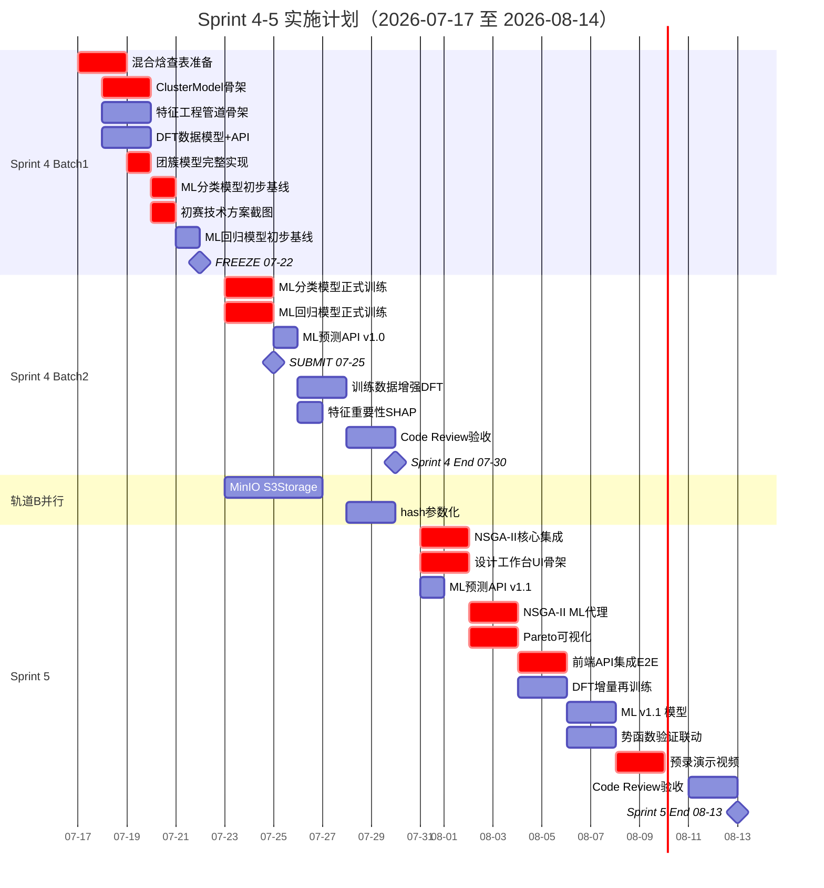
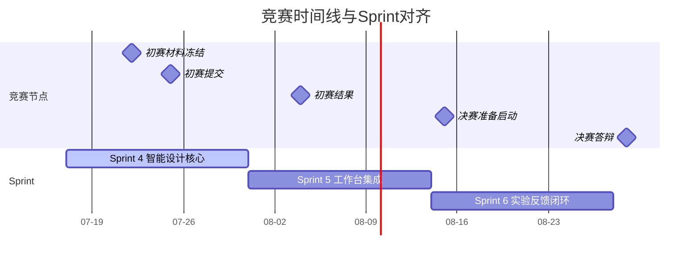

# Sprint 4-5 合并实施计划

**基于技术路线图 v1.6**
**编制：** CTO
**日期：** 2026-07-18
**状态：** ✅ Approved by CEO (2026-07-19)

> **v1.1 更新（2026-07-18）：** 补充代码归属标注（研究代码 vs 生产代码）和两位ML研究员（Dr. Alexander Petrov / Dr. Ingrid Novak）的明确分工。ML工程师瓶颈已解除。
>
> **v1.2 更新（2026-07-18）：** §2.2-2.3 和 §3.2 的 Day-level 任务表全部替换为 Petrov/Novak 具体指派（原"ML工程师"泛称）。CTO 确认四项架构问题（代码目录划分、Lead Engineer分工、optimize schema ADR流程）。

## 0. 代码归属与角色分工原则（v1.1 新增）

### 0.1 代码归属分层

| 代码层 | 目录 | 谁写 | 评审流程 |
|--------|------|------|---------|
| **研究代码** | `apps/api/src/nfm_db/ml/` | Petrov / Novak | CTO review（算法正确性） |
| **研究代码** | `experiments/` (notebook/scripts) | Petrov / Novak | 不上CI，仅记录 |
| **模型工件** | `models/*.pkl` | Petrov / Novak | 版本号+metadata |
| **生产代码** | `apps/api/src/nfm_db/api/` | Lead Engineer | Code Reviewer + CI |
| **生产代码** | `apps/web/src/` | 前端工程师 | Code Reviewer + CI |
| **数据库迁移** | `alembic/versions/` | 后端工程师 | CTO review + CI |

### 0.2 两位ML研究员分工

| 研究员 | 技能 | Sprint 4 角色 | Sprint 5 角色 |
|--------|------|--------------|--------------|
| **Dr. Alexander Petrov** | scikit-learn, pytorch-lightning | 主力：特征工程 + ML模型训练 | 支持：ML模型v1.1 + 推理接口对齐 |
| **Dr. Ingrid Novak** | pymoo, simpy, dask, polars | 预研：NSGA-II骨架 | 主力：NSGA-II集成 + Pareto优化 |

### 0.3 交接机制

研究员完成算法后，**创建交接issue**给Lead Engineer封装为API：
- 交接物：模型工件 + 推理脚本 + 输入输出schema + pytest
- Lead Engineer封装为FastAPI路由 → PR → Code Reviewer → CI

---

## 目录

1. [总体概况](#1-总体概况)
2. [Sprint 4 详细分解（07-17 至 07-30）](#2-sprint-4-详细分解)
3. [Sprint 5 详细分解（07-31 至 08-13）](#3-sprint-5-详细分解)
4. [资源与人员分配](#4-资源与人员分配)
5. [技术风险与缓解措施](#5-技术风险与缓解措施)
6. [基础设施并行任务（轨道B Phase 1）](#6-基础设施并行任务)
7. [甘特图](#7-甘特图)
8. [附录：任务验收标准清单](#8-附录任务验收标准清单)

---

## 1. 总体概况

### 1.1 时间窗口

| Sprint | 日期范围 | 天数 | 关键约束 |
|--------|---------|------|---------|
| Sprint 4 | 2026-07-17（Fri）至 2026-07-30（Thu） | 14天 | **07-22 初赛材料冻结**、07-25 初赛提交 |
| Sprint 5 | 2026-07-31（Fri）至 2026-08-13（Thu） | 14天 | 08-初 初赛结果、08-15 决赛准备启动 |

### 1.2 竞赛时间线约束

```
07-17 ── 07-20 ── 07-22 ── 07-25 ── 07-30 ── 08-13
  │        │        │        │        │        │
  Day 1    Batch1    FREEZE   SUBMIT   Sprint4  Sprint5
  Sprint4  Tech     ⛔        📸       End      End
  Start    Spec     截止      提交
           Ready
```

> ⚠️ **07-22距今4天**。Sprint 4交付分两批：
> - **Batch 1（07-17→07-21）**：技术方案+核心算法骨架，服务于初赛材料技术描述
> - **Batch 2（07-23→07-30）**：完整ML模型训练+API集成+CI/CD

### 1.3 核心交付目标

| Sprint | 核心交付 | 竞赛展示价值 |
|--------|---------|-------------|
| Sprint 4 | 团簇模型+特征工程+ML预测初版 | 申报书"领域知识约束ML"技术路线有实物支撑 |
| Sprint 5 | NSGA-II优化+设计工作台+验证联动 | 答辩演示场景二"从数据到设计"可Live或预录 |

### 1.4 优先级策略

| 优先级 | 任务类别 | 原因 |
|--------|---------|------|
| **P0** | 团簇模型、特征工程、ML分类/回归、DFT数据模型 | 申报书核心创新点，初赛必须展示 |
| **P1** | NSGA-II优化、成分设计工作台UI、ML预测API | 决赛演示依赖，Sprint 5交付 |
| **P2** | 势函数验证联动、CALPHAD数据、RAG增强 | 加分项，时间不够可降级 |
| **P3** | 数据血缘可视化、DNA水印、Plugin Registry | Sprint 6-8范围 |

---

## 2. Sprint 4 详细分解

### Sprint 4 Definition of Done

- [ ] `ClusterCompositionGenerator` 可生成5000+候选成分，四类构型分布合理（Type I-IV均有输出）
- [ ] 8个物理特征（Mo当量/电负性差/构型熵/B-V比/铀密度/混合焓/晶格畸变/Allen电负性差）正确计算
- [ ] 历史Materials数据批量回填物理特征完成
- [ ] ML分类模型（PhaseClassifier v1.0）5-fold CV准确率 >75%
- [ ] ML回归模型（TempPredictor v1.0）Leave-one-out MAE <40℃
- [ ] DFT计算数据模型+CRUD API上线（支持泛函/截断能/K点/收敛判据/形成能/结合能/晶格畸变）
- [ ] 团簇模型API（`POST /api/v1/composition/generate`）可调用
- [ ] ML预测API（`POST /api/v1/predict/phase-stability`）可调用（初步版）
- [ ] CI/CD通过：PR → CodeQL → API Tests → 合并
- [ ] **07-22前**：初赛技术方案截图/演示素材ready
- [ ] **07-25前**：申报书演示截图素材ready

### 2.1 任务依赖图

```
                         ┌─────────────────────────┐
                         │  混合焓查表数据准备       │ ← DFT/材料专家配合
                         │  (Miedema模型参数)       │
                         └────────────┬────────────┘
                                      │
                    ┌─────────────────┼─────────────────┐
                    ▼                 ▼                   ▼
         ┌──────────────────┐ ┌──────────────┐ ┌──────────────────┐
         │ ClusterModel     │ │ FeatureEng   │ │ DFT Data Model   │
         │ 骨架+分类逻辑    │ │ 管道骨架      │ │ + CRUD API       │
         └────────┬─────────┘ └──────┬───────┘ └──────────────────┘
                  │                   │
                  │            ┌──────┴───────┐
                  │            ▼              ▼
                  │   ┌──────────────┐ ┌──────────────┐
                  │   │ 批量特征回填  │ │ 训练数据集    │
                  │   │ (历史数据)    │ │ 构建+验证     │
                  │   └──────┬───────┘ └──────┬───────┘
                  │          │                │
                  └──────────┼────────────────┘
                             ▼
                   ┌──────────────────┐
                   │ ML模型训练       │
                   │ 分类(PhaseCls)   │
                   │ 回归(TempPred)   │
                   └────────┬─────────┘
                            ▼
                   ┌──────────────────┐
                   │ ML预测API        │
                   │ + 特征重要性     │
                   └──────────────────┘
```

> **并行策略**：ClusterModel、FeatureEng管道、DFT数据模型三者可并行开发。ML训练是唯一的汇聚依赖点。

### 2.2 Batch 1：初赛材料冻结（07-17 至 07-22）

> 目标：07-22前产出可用于初赛申报书的技术方案描述和演示截图。
> 策略：优先让算法骨架和API可跑通，训练用小数据集快速验证，精度指标标注为"初步"。

#### Day 1（07-17 Thu）— 已过 / 启动日

| 时段 | 任务 | 负责角色 | 产出 | 工时 |
|------|------|---------|------|------|
| 全天 | Sprint 4 Kickoff：任务拆分、环境准备、依赖安装（scikit-learn/xgboost/pymoo） | 全员 | Sprint 4任务看板 | 0.5d |
| 全天 | **混合焓查表数据准备**：Miedema模型参数收集（U-X二元对混合焓），整理为Python查表结构 | **Petrov**/CTO | `mixing_enthalpy_data.py` | 1.0d |
| 全天 | DFT数据模型Schema设计：字段定义（泛函/截断能/K点/收敛判据/形成能/结合能/晶格畸变） | 后端工程师 | Schema draft | 0.5d |

#### Day 2（07-18 Fri）— 今日

| 时段 | 任务 | 负责角色 | 产出 | 工时 |
|------|------|---------|------|------|
| 上午 | **ClusterCompositionGenerator骨架**：`classify_cluster_type()` + `generate_candidates()` 骨架代码 | **Petrov** | `cluster_model.py` 骨架 | 0.5d |
| 上午 | DFT数据模型Alembic迁移+ORM模型 | 后端工程师 | Alembic migration + model | 0.5d |
| 下午 | **特征工程管道骨架**：Mo当量/电负性差/构型熵计算函数 | **Petrov** | `feature_engineering.py` 骨架 | 0.5d |
| 下午 | 团簇模型API Router（`POST /api/v1/composition/generate`） | 后端工程师 | API endpoint skeleton | 0.5d |

#### Day 3-4（07-19 Sat — 07-20 Sun）

> 周末开发日。目标：核心算法逻辑跑通，产出可用于截图的Jupyter Notebook验证结果。

| 时段 | 任务 | 负责角色 | 产出 | 工时 |
|------|------|---------|------|------|
| 07-19 | **团簇模型完整实现**：四类构型分类 + 候选成分生成（5000样本） + 输出校验 | **Petrov** | 完整`cluster_model.py` | 1.0d |
| 07-19 | 特征计算剩余函数：B/V比/铀密度/混合焓/晶格畸变 | **Petrov** | 8个特征函数完成 | 0.5d |
| 07-19 | DFT数据CRUD API实现（5个端点） | 后端工程师 | CRUD API | 0.5d |
| 07-20 | **初赛技术方案整理**：截图团簇模型Jupyter输出、特征工程可视化、API Swagger文档 | CTO+Creative | 技术方案截图素材 | 0.5d |
| 07-20 | **ML分类模型初步训练**：用55组实验数据快速训练RandomForest基线，验证pipeline跑通 | **Petrov** | PhaseClassifier v0.1 + accuracy report | 0.5d |

#### Day 5（07-21 Mon）

| 时段 | 任务 | 负责角色 | 产出 | 工时 |
|------|------|---------|------|------|
| 上午 | **初赛材料最终检查**：技术方案截图审核、演示素材准备、API文档截图 | CTO | 初赛材料包 | 0.5d |
| 上午 | FeatureEng管道：与团簇模型输出对接，批量特征计算pipeline | **Petrov** | Pipeline可运行 | 0.5d |
| 下午 | ML回归模型初步训练：GPR基线，验证pipeline跑通 | **Petrov** | TempPredictor v0.1 + MAE report | 0.5d |
| 下午 | 历史Materials数据特征回填脚本 | **Petrov**/后端 | 回填脚本 | 0.5d |

#### Day 6（07-22 Tue）— ⛔ 初赛材料冻结

| 时段 | 任务 | 负责角色 | 产出 | 工时 |
|------|------|---------|------|------|
| 上午 | **初赛材料提交冻结** | CEO | 申报书技术部分定稿 | — |
| 全天 | 批量特征回填执行（异步） | **Petrov** | 历史数据特征值写入DB | 0.5d |
| 全天 | CI/CD配置：团簇模型+特征工程+API的测试用例 | 后端工程师 | pytest测试套件 | 0.5d |

### 2.3 Batch 2：后续开发（07-23 至 07-30）

> 初赛冻结后，集中精力提升模型精度和完善API。

#### Day 7-8（07-23 Wed — 07-24 Thu）

| 时段 | 任务 | 负责角色 | 产出 | 工时 |
|------|------|---------|------|------|
| 全天 | **ML分类模型正式训练**：RF + XGBoost ensemble，5-fold CV，>75%目标 | **Petrov** | PhaseClassifier v1.0 | 1.5d |
| 全天 | **ML回归模型正式训练**：GPR + SVR ensemble，LOO-CV，<40℃目标 | **Petrov** | TempPredictor v1.0 | 1.5d |
| 全天 | 历史Materials数据特征回填完成+数据质量校验 | 后端工程师 | 回填完成 | 0.5d |
| 全天 | 团簇模型API + 特征计算API + ML预测API 集成测试 | 后端工程师 | 集成测试通过 | 0.5d |

#### Day 9（07-25 Fri）— 📸 初赛提交日

| 时段 | 任务 | 负责角色 | 产出 | 工时 |
|------|------|---------|------|------|
| 上午 | **初赛提交**（申报书+演示材料） | CEO | 提交完成 | — |
| 上午 | ML预测API实现（`POST /api/v1/predict/phase-stability`） | 后端工程师 | 预测API v1.0 | 0.5d |
| 下午 | API Swagger文档更新（新增端点中文描述） | 后端工程师 | OpenAPI spec | 0.25d |
| 下午 | CI/CD：ML预测API的自动化测试 | 后端工程师 | CI green | 0.25d |

#### Day 10-11（07-26 Sat — 07-27 Sun）

| 时段 | 任务 | 负责角色 | 产出 | 工时 |
|------|------|---------|------|------|
| 全天 | **训练数据增强**：整合1200组DFT计算数据到训练集（需院内DFT专家配合导出数据） | **Petrov**+DFT专家 | 扩展训练集 | 1.0d |
| 全天 | 特征重要性分析：SHAP values，输出特征重要性排序 | **Petrov** | Feature importance report | 0.5d |
| 全天 | EnergyPredictor（结合能回归）初步训练 | **Petrov** | EnergyPredictor v0.1 | 0.5d |

#### Day 12-13（07-28 Mon — 07-29 Tue）

| 时段 | 任务 | 负责角色 | 产出 | 工时 |
|------|------|---------|------|------|
| 全天 | **Sprint 4 代码Review + Bug Fix**：所有Sprint 4代码走Code Review | 全员 | Review通过 | 0.5d/人 |
| 全天 | 模型版本管理：ML模型序列化+版本号+v1.0.0 tag | **Petrov** | 模型版本化方案 | 0.5d |
| 全天 | Sprint 4 DoD逐项验收 | CTO | 验收报告 | 0.5d |
| 全天 | Sprint 5 准备：NSGA-II原型验证（小规模测试） | **Novak** | pymoo集成POC | 0.5d |

#### Day 14（07-30 Wed）— Sprint 4 收尾

| 时段 | 任务 | 负责角色 | 产出 | 工时 |
|------|------|---------|------|------|
| 上午 | Sprint 4 Retrospective | 全员 | Retrospective notes | 0.5d |
| 上午 | Sprint 5 Planning：任务确认+依赖检查 | CTO | Sprint 5 plan | 0.5d |
| 下午 | Buffer / 紧急Bug修复 | 全员 | — | 0.5d |

### 2.4 Sprint 4 工时汇总（v1.1 — 按实际人员拆分）

| 角色 | Batch 1 (d) | Batch 2 (d) | 总计 (d) | 代码归属 | 备注 |
|------|------------|------------|---------|---------|------|
| **Petrov**（ML主力） | 4.0 | 5.0 | **9.0** | `ml/` 目录 | 团簇模型+特征工程+训练 |
| **Novak**（NSGA预研） | 0 | 1.0 | **1.0** | `experiments/` | Day 11-14 pymoo骨架 |
| 后端工程师 | 2.0 | 2.5 | **4.5** | `api/` + `alembic/` | DFT模型+API封装+CI |
| CTO | 1.0 | 0.5 | **1.5** | — | 技术方案+验收+review |
| Domain Expert | 0.5 | 0 | **0.5** | — | 混合焓查表审核 |
| **合计** | **7.5** | **10.0** | **17.5** | — | — |

> 💡 Petrov是Sprint 4核心（9天）。Novak在Sprint 4仅预研（1天），为Sprint 5做准备。

---

## 3. Sprint 5 详细分解

### Sprint 5 Definition of Done

- [ ] NSGA-II多目标优化通过API可调用（`POST /api/v1/design/optimize`），输出Pareto前沿
- [ ] 成分设计工作台页面（`/design`）上线：目标设置→优化执行→Pareto可视化→推荐详情
- [ ] ML预测API集成到设计工作台（分类+回归+特征重要性+置信区间）
- [ ] 势函数验证联动：从推荐成分一键创建LAMMPS验证任务
- [ ] 训练数据扩展至1400+组（55实验+1200DFT+200增量DFT）
- [ ] ML精度提升：分类>78%，回归MAE<35℃
- [ ] CI/CD通过，所有新增端点有自动化测试
- [ ] Sprint 4-5整体DoD验收通过

### 3.1 任务依赖图

```
Sprint 4 产出 ──────────────────────────────────────────────┐
(ML模型+团簇模型+特征工程+API)                                 │
                                                               │
  ┌───────────────────────────────────────────────────────────┘
  │
  ├──────────────────────────────────┐
  ▼                                  ▼
┌──────────────────┐        ┌──────────────────┐
│ NSGA-II集成      │        │ 设计工作台UI      │
│ (pymoo+ML代理)   │───────→│ (Next.js前端)     │
│ + API            │        │ /design页面       │
└────────┬─────────┘        └────────┬─────────┘
         │                           │
         ▼                           ▼
┌──────────────────┐        ┌──────────────────┐
│ ML预测API完善      │        │ ML预测集成        │
│ (v1.1+版本管理)    │        │ (前端调用)         │
└──────────────────┘        └──────────────────┘
         │                           │
         └───────────┬───────────────┘
                     ▼
           ┌──────────────────┐
           │ 势函数验证联动     │
           │ (推荐→验证任务)    │
           └──────────────────┘
```

> **关键路径**：NSGA-II → 设计工作台 → 势函数联动。前端可并行开发UI骨架，但真实数据依赖NSGA-II API就绪。

### 3.2 Day-by-day分解

#### Day 1-2（07-31 Fri — 08-01 Sat）

| 时段 | 任务 | 负责角色 | 产出 | 工时 |
|------|------|---------|------|------|
| 全天 | **NSGA-II核心集成**：pymoo Problem定义、目标函数（铀密度/相稳定温度/可制备性）、约束条件 | **Novak** | NSGA-II core module | 1.5d |
| 全天 | **设计工作台UI骨架**：目标设置面板+约束条件面板+Pareto图占位+推荐详情占位 | 前端工程师 | `/design` page skeleton | 1.0d |
| 全天 | ML预测API v1.1：新增model_version字段、confidence评分逻辑 | 后端工程师 | API v1.1 | 0.5d |

#### Day 3-4（08-02 Sun — 08-03 Mon）

| 时段 | 任务 | 负责角色 | 产出 | 工时 |
|------|------|---------|------|------|
| 全天 | **NSGA-II+ML代理模型集成**：用ML预测替代昂贵的DFT计算，加速优化评估 | **Novak** | ML surrogate integration | 1.0d |
| 全天 | 设计工作台：Pareto前沿ECharts可视化（2D散点+TOP-3标注+hover详情） | 前端工程师 | Pareto chart component | 1.0d |
| 全天 | 优化API（`POST /api/v1/design/optimize`）实现 | 后端工程师 | Optimize API | 0.5d |

#### Day 5-6（08-04 Tue — 08-05 Wed）

| 时段 | 任务 | 负责角色 | 产出 | 工时 |
|------|------|---------|------|------|
| 全天 | **前端API集成**：设计工作台调用优化API+ML预测API，端到端跑通 | 前端+后端 | E2E flow working | 1.0d |
| 全天 | 收敛曲线输出：NSGA-II generational distance + hypervolume指标 | **Novak** | Convergence metrics | 0.5d |
| 全天 | **DFT增量数据整合**：200组新DFT数据导入+特征计算+训练集扩展 | **Petrov**+DFT专家 | 扩展训练集 | 1.0d |

#### Day 7-8（08-06 Thu — 08-07 Fri）

| 时段 | 任务 | 负责角色 | 产出 | 工时 |
|------|------|---------|------|------|
| 全天 | **ML模型再训练（v1.1）**：扩展训练集，目标分类>78%、MAE<35℃ | **Petrov** | ML v1.1 models | 1.0d |
| 全天 | 势函数验证联动：推荐成分→创建LAMMPS验证任务→A-F评级 | 全栈工程师 | Verification linkage | 1.0d |
| 全天 | 设计工作台交互打磨：Loading/Empty/Error/Success四态 | 前端工程师 | UX polish | 0.5d |

#### Day 9-10（08-08 Sat — 08-09 Sun）

| 时段 | 任务 | 负责角色 | 产出 | 工时 |
|------|------|---------|------|------|
| 全天 | **预录演示视频**：场景二"从数据到设计"完整流程预录（Plan B素材） | CTO+Creative | 10分钟演示视频 | 1.0d |
| 全天 | CI/CD：设计工作台+优化API+联动功能的E2E自动化测试 | 后端工程师 | E2E test suite | 0.5d |
| 全天 | Bug Fix + 性能优化（优化响应时间<30s） | 全员 | — | 0.5d/人 |

#### Day 11-12（08-11 Mon — 08-12 Tue）

| 时段 | 任务 | 负责角色 | 产出 | 工时 |
|------|------|---------|------|------|
| 全天 | **Sprint 5 代码Review** | 全员 | Review通过 | 0.5d/人 |
| 全天 | Sprint 5 DoD逐项验收 | CTO | 验收报告 | 0.5d |
| 全天 | Sprint 4-5整体回顾：技术债务记录、Sprint 6准备 | CTO | Retrospective + Sprint 6 plan | 0.5d |
| 全天 | 文档更新：API文档、ML模型报告、部署说明 | 后端工程师 | Updated docs | 0.5d |

#### Day 13-14（08-13 Wed — 08-14 Thu）— Buffer

| 时段 | 任务 | 负责角色 | 产出 | 工时 |
|------|------|---------|------|------|
| 全天 | Buffer / 紧急修复 / 决赛准备启动 | 全员 | — | 0.5d/人 |

### 3.3 Sprint 5 工时汇总（v1.1 — 按实际人员拆分）

| 角色 | 工时 (d) | 代码归属 | 备注 |
|------|---------|---------|------|
| **Novak**（优化主力） | 4.5 | `ml/optimizer.py` | NSGA-II+代理模型+收敛指标 |
| **Petrov**（ML支持） | 2.0 | `ml/`（v1.1模型） | ML再训练+推理接口对齐 |
| 前端工程师 | 3.0 | `apps/web/src/app/design/` | 设计工作台UI |
| 后端工程师 | 2.5 | `api/v1/design.py` + CI/CD | 优化API封装+E2E测试 |
| 全栈工程师 | 1.0 | `api/v1/verification.py` | 势函数验证联动 |
| CTO | 1.5 | — | 验收+预录+回顾 |
| **合计** | **14.5** | — | — |

> 💡 Novak是Sprint 5核心（4.5天）。Sprint 4→5的主力交接：Petrov（ML）→ Novak（优化）。

---

## 4. 资源与人员分配

### 4.1 角色分配矩阵（v1.1 — 明确代码归属与研究员分工）

> **标注规则**：每项任务标注 **[谁写]**（代码作者）和 **[谁评审]**。研究员只写研究代码（`ml/`目录），生产代码交给工程师。

| 任务 | [谁写] 代码作者 | 代码归属 | [谁评审] | 院内配合 | 估计工时 |
|------|---------------|---------|---------|---------|---------|
| 混合焓查表准备 | **Petrov** | `ml/data/mixing_enthalpy.py` | CTO + Domain Expert | DFT/材料专家 | 1.0d |
| ClusterCompositionGenerator | **Petrov** | `ml/cluster_model.py` | CTO（算法）→ Domain Expert（物理） | — | 1.5d |
| 特征工程管道 | **Petrov** | `ml/feature_engineering.py` | CTO + Domain Expert（公式验证） | — | 1.5d |
| ML分类模型训练 | **Petrov** | `ml/train_phase_classifier.py` + `models/phase_v1.pkl` | CTO | — | 2.5d |
| ML回归模型训练 | **Petrov** | `ml/train_temp_predictor.py` + `models/temp_v1.pkl` | CTO | — | 2.0d |
| DFT数据模型+Alembic | **后端工程师** | `models/dft.py` + `alembic/` | CTO + Code Reviewer | DFT专家 | 1.0d |
| 批量特征回填 | **Petrov** | `ml/backfill_features.py` | CTO | — | 0.5d |
| 特征回填DB写入 | **后端工程师** | `api/v1/materials.py`（PATCH端点） | Code Reviewer + CI | — | 0.5d |
| ML预测API封装 | **Lead Engineer** | `api/v1/predict.py`（封装Petrov的predict函数） | Code Reviewer + CI | — | 1.0d |
| 团簇模型API封装 | **Lead Engineer** | `api/v1/composition.py`（封装Petrov的generate函数） | Code Reviewer + CI | — | 0.5d |
| NSGA-II骨架预研（Sprint 4） | **Novak** | `experiments/nsga2_skeleton.py` | CTO（可行性） | — | 1.0d |
| NSGA-II核心集成（Sprint 5） | **Novak** | `ml/optimizer.py` | CTO（算法） | — | 2.5d |
| 优化API封装 | **Lead Engineer** | `api/v1/design.py`（封装Novak的optimize函数） | Code Reviewer + CI | — | 0.5d |
| 设计工作台UI | **前端工程师** | `apps/web/src/app/design/` | Code Reviewer + CI | — | 3.0d |
| 势函数验证联动 | **全栈工程师** | `api/v1/verification.py`（已有，扩展） | Code Reviewer + CI | — | 1.0d |
| 预录演示视频 | CTO | — | Creative Director | — | 1.0d |
| CI/CD + 测试 | **后端工程师** | `.github/workflows/`, `tests/` | CTO | — | 1.5d |

### 4.2 ML研究员到位状态（v1.1 — 风险已解除）

> ✅ **2026-07-18更新：两位ML研究员已从K-Dense Science Lab复制到NFMD，风险解除。**

| 研究员 | 到位状态 | 技能匹配 | Sprint 4-5角色 |
|--------|---------|---------|---------------|
| Dr. Alexander Petrov | ✅ 已就位 | scikit-learn, pytorch-lightning | Sprint 4主力（ML训练） |
| Dr. Ingrid Novak | ✅ 已就位 | pymoo, simpy, dask, polars | Sprint 5主力（NSGA-II优化） |

**原"ML工程师不到位风险"已消除。** 剩余风险调整为：

| 情景 | 影响 | 缓解方案 |
|------|------|---------|
| Petrov对核材料领域不熟悉 | 特征工程物理意义偏差 | Nuclear Domain Expert在Day 2-4提供混合焓查表+公式审核 |
| Novak的pymoo经验需要适应项目框架 | NSGA-II集成延迟0.5-1d | Sprint 4预研期（Day 11-14）充分验证pymoo API |
| 研究员不熟悉Git Workflow | PR流程摩擦 | Lead Engineer协助，交接issue模板明确产出格式 |

### 4.3 院内DFT/材料专家配合需求

| 任务 | 配合内容 | 需要时间 | 紧急度 |
|------|---------|---------|--------|
| 混合焓查表审核 | 审核Miedema参数的U-X二元对数值 | 0.5d | 🔴 高（Day 2前） |
| 1200组DFT数据导出 | 从院内部署的计算平台导出DFT计算结果 | 1.0d | 🟡 中（Day 7前） |
| 200组增量DFT数据 | Sprint 5期间新增DFT计算 | 持续 | 🟡 中（Sprint 5） |
| 物理特征验证 | 验证特征计算公式的物理合理性 | 0.5d | 🔴 高（Day 4前） |

---

## 5. 技术风险与缓解措施

### 5.1 风险矩阵

| # | 风险 | 概率 | 影响 | 综合 | 缓解措施 |
|---|------|------|------|------|---------|
| R1 | ML工程师不到位 | 中 | 极高 | **🔴** | §4.2三级行动方案 |
| R2 | ML训练数据不足（55实验+1200DFT） | 高 | 高 | **🔴** | §5.2具体步骤 |
| R3 | 团簇模型混合焓数据覆盖不全 | 中 | 中 | **🟡** | §5.3补全方案 |
| R4 | 初赛演示功能未完成 | 中 | 高 | **🟡** | §5.4降级路径 |
| R5 | HPC资源排队导致DFT延迟 | 低 | 中 | **🟢** | 预计算缓存+云端补充 |
| R6 | pymoo NSGA-II性能不满足实时需求 | 低 | 中 | **🟢** | ML代理模型+预计算Pareto前沿 |

### 5.2 ML训练数据不足的具体缓解步骤

> **现状**：55组实验数据+1200组DFT数据。申报书目标：分类>80%、MAE<30℃。

| 步骤 | 行动 | 预期效果 | 执行时机 |
|------|------|---------|---------|
| **S1: 物理约束正则化** | 团簇模型构型类型作为ML输入特征（4类one-hot），物理先验约束特征空间 | 减少有效维度，降低过拟合风险 | Sprint 4 Day 3-4 |
| **S2: 迁移学习** | 用1200组DFT数据预训练特征表示，再在55组实验数据上fine-tune | 利用DFT丰富特征空间弥补实验数据稀缺 | Sprint 4 Day 7-8 |
| **S3: 数据增广** | 成分微小扰动（±0.5 at.%）生成增广样本+标签平滑 | 扩大有效训练集3-5倍 | Sprint 4 Day 7-8 |
| **S4: 不确定性量化** | GPR天然输出置信区间，公开展示 | 提升可信度叙事，评委可接受"我们知道不确定性" | Sprint 4 Day 8 |
| **S5: Leave-one-out CV** | 小样本场景最优验证方法 | 避免数据划分偏差 | Sprint 4 Day 7-8 |
| **S6: Sprint 6实验补充** | +20组新实验数据通过实验录入模块 | 达到申报书终期指标（>80%、<30℃） | Sprint 6 |

**Sprint 4初步指标（可接受）**：分类>75%、MAE<40℃。到Sprint 6达到终期指标。

### 5.3 团簇模型混合焓数据补全方案

> **现状**：Miedema模型覆盖大部分U-X二元对，但部分稀有元素（如Re、Tc）数据缺失。

| 步骤 | 行动 | 数据来源 |
|------|------|---------|
| F1 | 优先用已有Miedema参数（U-Mo, U-Nb, U-Ti, U-V, U-Zr, U-Cr, U-Fe） | 文献查表，已有 |
| F2 | 缺失二元对用CALPHAD计算混合焓替代 | Thermo-Calc/Pandat计算 |
| F3 | 极端缺失元素降级为Type IV（保守处理） | 算法兜底 |
| F4 | Sprint 6补充：DFT计算形成能替代混合焓 | 院内DFT专家配合 |

### 5.4 初赛演示的Plan B降级路径

| 降级级别 | 触发条件 | 降级方案 | 答辩叙事 |
|---------|---------|---------|---------|
| **B-0 正常** | ML模型>75%准确率 | 完整Live演示：团簇→ML→NSGA-II→Pareto | 正常叙事 |
| **B-1 聚焦单物理量** | ML分类<75%但回归可用 | 仅展示铀密度单目标优化，跳过多目标 | "小数据场景聚焦高价值单物理量更务实" |
| **B-2 团簇模型+知识图谱** | ML完全不可用 | 展示团簇模型物理规则生成+KG关联推荐 | "领域知识本身蕴含设计智慧" |
| **B-3 数据治理+验证** | 团簇模型也未完成 | 全场景一（文献提取）+场景三（势函数验证）Live | **"数据治理和验证闭环是核心价值"** |

> 🎬 **预录保险**：无论哪个降级级别，Day 9-10必须预录完整10分钟演示视频作为备份。场景二预录尤其重要（ML最可能出问题）。

---

## 6. 基础设施并行任务

### 轨道B Phase 1：存储基础设施与合规前置设计

> 与Sprint 4-5并行推进，不阻塞功能开发。详见 [存储与合规路线图](storage-compliance-roadmap.md)。

| 任务 | 依赖Sprint 4-5？ | 负责角色 | 建议时机 | 工时 |
|------|----------------|---------|---------|------|
| **MinIO + S3Storage实现** | ❌ 不依赖 | 后端工程师 | Sprint 4 Day 7-10 | 1.5d |
| 文献上传管线（POST /literature/upload） | ❌ 不依赖 | 后端工程师 | Sprint 4 Day 10-14 | 1.0d |
| **hash算法参数化**（sha256/SM3可切换） | ❌ 不依赖 | 后端工程师 | Sprint 4 Day 12-14 | 0.5d |
| 全文索引（PG FTS tsvector + GIN） | ❌ 不依赖 | 后端工程师 | Sprint 5 Day 1-4 | 1.0d |
| 乐观锁（DataSource version） | ❌ 不依赖 | 后端工程师 | Sprint 5 Day 3-6 | 0.5d |
| LLM本地化验证（Ollama独立运行） | ❌ 不依赖 | 后端工程师 | Sprint 5 Day 1-2 | 0.5d |
| 网络入口预留（nginx反代模板） | ❌ 不依赖 | 后端工程师 | Sprint 5 Day 5-8 | 0.5d |

> 💡 基础设施总工时约5.5d，可由后端工程师在功能开发间隙穿插进行。**不增加额外人力需求**。

### Sprint 4-5前的前置依赖

| 基础设施任务 | 是否Sprint 4-5前置 | 说明 |
|-------------|------------------|------|
| MinIO docker-compose | ⚠️ Sprint 5的前置 | 文献上传管线需要S3Storage，但不影响ML开发 |
| hash参数化 | ❌ 不影响 | 合规前置设计，任何Sprint都可做 |
| 全文索引 | ❌ 不影响 | 现有content_md字段已有搜索能力 |

---

## 7. 甘特图



### 竞赛时间线标注甘特图



---

## 8. 附录：任务验收标准清单

### 8.1 Sprint 4 验收清单

| # | 验收项 | 验收标准 | 验证方式 |
|---|--------|---------|---------|
| V4-1 | ClusterCompositionGenerator | 生成5000+候选，四类构型均有输出（Type I>10%, Type II>10%, Type III>5%, Type IV≥0%） | pytest自动化 |
| V4-2 | 物理特征计算 | 8个特征对已知合金（U-10Mo）计算结果与文献值误差<5% | 手动验证+单元测试 |
| V4-3 | 批量特征回填 | 所有历史Materials记录均有特征值（NULL率<1%） | DB查询 |
| V4-4 | ML分类模型 | 5-fold CV准确率>75%，每个fold>70% | pytest自动化 |
| V4-5 | ML回归模型 | LOO-CV MAE<40℃，R²>0.85 | pytest自动化 |
| V4-6 | DFT数据模型 | CRUD 5个端点可正常创建/读取/更新/删除/列表 | API测试 |
| V4-7 | 团簇模型API | POST /api/v1/composition/generate 返回正确格式 | Swagger UI测试 |
| V4-8 | ML预测API | POST /api/v1/predict/phase-stability 返回分类+回归+特征重要性 | Swagger UI测试 |
| V4-9 | CI/CD | PR合并前CodeQL通过，API测试全绿 | GitHub Actions |
| V4-10 | 初赛材料 | 技术方案截图+API文档截图+ML验证报告 | CEO审核 |

### 8.2 Sprint 5 验收清单

| # | 验收项 | 验收标准 | 验证方式 |
|---|--------|---------|---------|
| V5-1 | NSGA-II优化 | 输出Pareto前沿≥10个非支配解，收敛曲线收敛 | API测试+可视化 |
| V5-2 | 设计工作台 | 目标设置→优化→Pareto图→推荐详情完整流程可操作 | E2E手动测试 |
| V5-3 | ML预测集成 | 工作台内显示ML分类/回归/特征重要性/置信区间 | 手动验证 |
| V5-4 | 势函数联动 | 从推荐成分一键创建LAMMPS验证任务，任务在MD Runner队列中 | E2E手动测试 |
| V5-5 | ML精度提升 | 分类>78%，回归MAE<35℃ | pytest自动化 |
| V5-6 | 预录视频 | 10分钟完整演示视频，包含场景一+二+三 | 人工审核 |
| V5-7 | CI/CD | 新增端点均有自动化测试 | GitHub Actions |
| V5-8 | 优化性能 | 200种群×100代优化在60s内完成 | 计时测试 |

---

## 文档信息

| 字段 | 值 |
|------|---|
| 版本 | v1.2 |
| 编制日期 | 2026-07-18 |
| 基于路线图版本 | v1.6 |
| 状态 | ✅ Approved by CEO (2026-07-19) |
| 下一步 | CPO拆分为Paperclip子任务并分配执行 |
