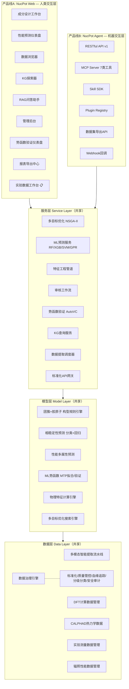

# 核燃料材料数据平台与智能设计工具研发技术路线图

**项目名称：** 领域知识数据加速新型核燃料研发
**编制单位：** 中国核动力研究设计院 先进核能全国重点实验室
**文档版本：** v1.6
**编制日期：** 2026年7月17日
**文档密级：** 内部

> **版本说明：** v1.6 补充文献存储与合规技术栈调研成果：§3.2技术选型新增文件存储层（StorageBackend抽象+MinIO→信创演进），§7.8新增基础设施与合规并行轨道（涉密+信创三阶段路径+国密改造+测评周期），§4.3安全增强新增涉密信创维度。v1.5 CTO完成§3.2双轨数据流动与模块共享治理全部技术细节编写（R17 CTO补充）：数据写入统一接口Service Layer Gate（三层校验架构+血缘注入+质量评分路由+事件发布）、数据血缘跨产品线追踪（DataProvenance/DataLineageEdge模型+溯源查询API+Agent导出支持）、共享层模块治理模型（六层治理等级+RFC模板+Sprint双线验证检查清单）、Schema版本管理协议（7类变更策略+Pydantic版本化+API路由策略+兼容性测试自动化）、读取一致性与回传闭环设计。v1.4整合CEO第二轮反馈（R16-R17）：新增§1.7实验数据收集录入模块设计、§3.2双轨数据流动与模块共享治理（CTO编写占位）、升级§2.3能力成熟度新增实验数据录入行、升级§3.1五层架构图Web应用层新增实验数据工作台、升级§7.4 Sprint 6实验数据录入表单为完整模块。v1.3在v1.2基础上，新增CEO双产品线战略愿景（§1.6），将平台定位从单一Web产品升级为"Web交互产品 + 智能体开发平台"双轨架构。

> **排版规范（CJK）：**
> - 中文正文 `line-height: 1.8`
> - 表格中文内容 `font-size` 不小于 `14px`
> - 章节标题与正文间距 `2em`

---

## 目录

1. [项目背景与战略定位](#1-项目背景与战略定位)
2. [现状评估：已建系统能力清单](#2-现状评估已建系统能力清单)
3. [总体技术框架设计（双产品线架构）](#3-总体技术框架设计双产品线架构)
4. [数据治理体系增强方案](#4-数据治理体系增强方案)

> §1.7 实验数据收集录入模块（R16）已在v1.4中新增。§3.2 双轨数据流动与模块共享治理（R17 CTO编写）已在v1.5中完成。
5. [智能设计引擎建设方案](#5-智能设计引擎建设方案)
6. [竞赛申报书技术路线对照与补充方案](#6-竞赛申报书技术路线对照与补充方案)
7. [分阶段实施路线图](#7-分阶段实施路线图)
8. [数据要素流通路径](#8-数据要素流通路径)
9. [商业模式与收入预测](#9-商业模式与收入预测)
10. [推广示范价值](#10-推广示范价值)
11. [团队协作与评审机制](#11-团队协作与评审机制)
12. [风险分析与应对策略](#12-风险分析与应对策略)
13. [竞争分析与差异化定位](#13-竞争分析与差异化定位)
14. [Plan B降级策略](#14-plan-b降级策略)
15. [演示场景与展示方案](#15-演示场景与展示方案)
16. [竞赛答辩策略](#16-竞赛答辩策略)
17. [附录](#附录)

---

## 1. 项目背景与战略定位

### 1.1 项目背景

超高通量研究堆对耐高温、耐强辐照、高铀密度的新型金属核燃料材料提出紧迫需求。U-10wt.%Mo合金在低温辐射环境下发生γ→α+U₂Mo共析分解，严重制约金属燃料工程化应用。传统"经验直觉—大量试错—实验筛选"研发模式周期长达10至20年，单批次成本数十万元。

与此同时，数十年来积累的第一性原理计算、CALPHAD热力学、相变温度实验、辐照性能数据分散于数万篇文献和各机构内部数据库中，数据孤岛问题突出。

### 1.2 战略定位

本项目定位为**核燃料材料数据治理与数据驱动成分设计的一体化平台**，覆盖从多模态数据智能提取到成分智能设计的完整链条，推动核燃料研发从"经验试错"向"数据+AI双驱动"范式转型。

### 1.3 电梯演讲（30秒版）

> **"我们建的不是又一个材料数据库——而是一个让核燃料数据从'沉睡'走向'驱动'的双轨平台：研究者用Web交互探索数据，AI智能体通过API/MCP/Plugin自主消费数据。"**
>
> 470+篇文献中沉睡的实验数据，经多模态AI提取后变为结构化知识资产；知识图谱将分散数据编织成关联网络；独创的AutoVC势函数验证引擎让数据从"可查"升级为"可信"；团簇模型约束的机器学习引擎让数据从"理解过去"跨越到"设计未来"。核材料领域首个数据要素全链路闭环平台，同时服务人类研究者和AI智能体两条产品线。

### 1.4 申报书定位

本项目同时服务于 **2026年"数据要素×"大赛科技创新赛道**参赛需求（团队名称：核智裂变，参赛单位：中国核动力研究设计院）。申报书的核心技术路线为：

> 多模态数据智能提取 → 数据融合治理 → 领域知识约束机器学习 → 多目标优化 → 实验验证 → 知识服务

平台建设需完整支撑上述技术路线的每一个环节，并形成可演示、可验证的系统能力。

### 1.5 竞赛时间线与里程碑

| 节点 | 日期 | 里程碑 | 对应Sprint |
|------|------|--------|-----------|
| **初赛材料冻结** | **2026-07-22** | 技术方案定稿，提交申报书 | Sprint 4进行中 |
| 初赛提交 | 2026-07-25 | 申报书+演示材料提交 | Sprint 4完成 |
| 初赛结果 | 2026-08-初 | 等待初赛评审结果 | Sprint 5 |
| 决赛准备启动 | 2026-08-15 | 商业策略补全+答辩材料 | Sprint 6-7 |
| 决赛答辩 | 2026-08-底 | 现场答辩+系统演示 | Sprint 7完成 |

> ⚠️ **关键约束**：Sprint 4（智能设计核心）与初赛材料冻结（07-22）存在2天重叠。Sprint 4交付物分为两批：07-20前完成技术方案部分，07-22前完成演示截图/视频部分。

---

## 1.6 双产品线战略（CEO愿景）

### 1.6.1 战略意图

平台未来将发展**两条互补的产品线**，服务两类截然不同的用户场景：

| 产品线 | 交付形态 | 目标用户 | 核心场景 | 交互模式 |
|--------|---------|---------|---------|---------|
| **产品线A：NucPot Web** | 浏览器端交互应用 | 科研人员、工程师、管理者 | 数据查询、下载、上传、知识问答、可视化分析 | 人机交互（GUI） |
| **产品线B：NucPot Agent** | API + MCP + Skill + Plugins | AI开发者、数据科学家、智能体 | 数据集开发、智能体驱动科学研究、自动化实验流程 | 机机交互（API/Protocol） |

### 1.6.2 战略分析：为什么是双轨而非单一产品

**第一性原理分析：**

核燃料材料数据的本质属性决定了它天然适配两种消费模式：
- **人类消费模式**：研究者需要可视化、交互式探索、知识问答——这是Web产品线的价值
- **机器消费模式**：AI智能体需要结构化API、批量数据集、可编程工作流——这是Agent产品线的价值

二者共享同一数据底座（80%的代码和基础设施），仅在应用层分化（20%的交付接口）。这不是重复建设，而是**同一资产的双重货币化**。

**Pareto分析（80/20法则）：**

- **共享层（80%价值）**：数据治理、ML模型、势函数验证、知识图谱——两条产品线完全复用
- **分化层（20%分化）**：Web UI vs API/MCP/Plugin封装——交付接口差异
- **关键洞察**：投入1单位基础设施，产出2单位产品覆盖面

**逆向思维（Inversion）——什么会导致双轨战略失败？**

| 失败模式 | 预防措施 |
|---------|---------|
| 两套独立代码库，重复建设 | API-first架构：Web UI作为API的消费端，不直接访问数据库 |
| 顾此失彼，一条线长期停滞 | 共享Sprint资源池，每条线每Sprint至少有1个交付物 |
| MCP/Plugin质量低，生态冷启动 | 先服务内部智能体（Paperclip MCP），验证后再对外开放 |
| API设计过度耦合Web场景 | RESTful + OpenAPI 3.0先行，独立于前端需求设计接口契约 |

**二阶思维：**

- **一阶效果**：覆盖人类研究者 + AI开发者两类用户
- **二阶效果**：Agent驱动的科学研究可**回传**新数据到平台，形成数据飞轮——智能体既是消费者也是生产者
- **三阶效果**：Plugin生态吸引第三方开发者，突破团队产能瓶颈，平台从"产品"进化为"生态"

### 1.6.3 双轨架构总览

```
                    ┌─────────────────────────────────────────────┐
                    │          共享数据与服务底座（80%）              │
                    │  数据层 → 模型层 → 服务层 → 标准化API网关      │
                    └──────────────────┬──────────────────────────┘
                                       │
                    ┌──────────────────┴──────────────────────────┐
                    │                                              │
           ┌────────┴─────────┐                      ┌──────────┴────────┐
           │  产品线A: NucPot Web │                      │ 产品线B: NucPot Agent │
           │  (人类交互层)        │                      │ (机器交互层)         │
           │                     │                      │                      │
           │  · 成分设计工作台    │                      │  · RESTful API (v1)   │
           │  · 实验数据工作台 📋│                      │  · MCP Server (7类)   │
           │  · 数据浏览器       │                      │  · Skill SDK           │
           │  · KG可视化探索     │                      │  · Plugin Registry     │
           │  · RAG知识问答      │                      │  · 数据集导出API       │
           │  · 势函数验证仪表盘 │                      │  · Webhook回调         │
           │  · 报表导出中心     │                      │  · 实验数据推送API 📋 │
           └─────────────────────┘                      └──────────────────────┘
```

> 💡 **架构原则**：**API-first，Web-as-a-client**。所有数据操作和能力调用必须经过标准化API网关，Web前端仅是API的一个消费端。这确保两条产品线共享同一接口契约，消除功能漂移风险。

---

## 1.7 实验数据收集录入模块（R16：CEO反馈补充）

### 1.7.1 战略必要性

**Pareto分析**：当前平台数据入口80%依赖文献提取（多模态V4-extraction），但最有价值的数据——**院内实验人员的原始实验结果**——没有直接输入通道。实验数据是ML模型训练、预测验证、知识图谱构建的核心燃料，缺失此模块导致：
- §5.2.3 ML可信度路线图Sprint 6承诺的"+20组实验录入"无接收机制
- §6.1竞赛对照第7项"实验验证闭环"在答辩中缺乏可信演示
- Agent产品线可通过API推送数据，但人类实验人员（核心数据生产者）被排除在平台之外

### 1.7.2 模块设计

实验数据工作台面向三类数据模态，提供模板化录入体验：

| 数据模态 | 录入方式 | 模板示例 | 存储方式 |
|---------|---------|---------|---------|
| **属性值** | 结构化表单（预填模板） | DSC模板（合金成分/升降温速率/峰值温度/相变类型/焓变）、HT-XRD模板（衍射角/晶面指数/晶格常数/相标识） | Properties表 + JSONB扩展字段 |
| **表格数据** | Excel/CSV批量上传 + 在线编辑 | 标准化列头映射（材料ID → 成分 → 实验条件 → 测量值 → 不确定度） | 批量解析 → 逐条入库 + 批次追踪 |
| **图片数据** | 多图上传 + 元数据标注 | SEM/TEM微观结构照片（标注放大倍数/区域/相组成）、金相照片、相图截图 | 对象存储 + 图片元数据表 + 关联材料ID |

### 1.7.3 模板化工作流

```
实验人员选择模板（DSC/HT-XRD/辐照/自定义）
       ↓
自动预填已知字段（材料体系/合金成分/实验人员信息从账号继承）
       ↓
Step 1 基础信息（材料体系/合金成分，自动预填）
       → Step 2 实验条件（温度/速率/气氛）
       → Step 3 测量结果（峰值温度/焓变/相变类型）
       ↓
图片上传区：拖拽区 + 缩略图预览 + 元数据侧边面板（非线性表单）
       ↓
自动校验（数据类型/范围/必填/交叉引用完整性）
       ↓
提交审核队列（可选：自动审核通过低风险数据）
       ↓
入库 + 自动触发物理特征计算（Mo当量/电负性差等）
       ↓
数据血缘记录（来源=实验录入，操作者=当前用户）
```

### 1.7.4 API设计

```
POST /api/v1/experiments/submit          提交实验数据（单条）
POST /api/v1/experiments/batch-upload    批量上传表格数据（CSV/Excel）
POST /api/v1/experiments/images          上传实验图片 + 元数据
GET  /api/v1/experiments/templates       获取可用实验模板列表
GET  /api/v1/experiments/{id}            查询实验数据详情
GET  /api/v1/experiments                 分页查询实验数据（支持按材料/类型/日期筛选）
```

> 💡 **双轨一致性**：上述API同时服务于产品线A（Web实验数据工作台调用）和产品线B（Agent通过API批量推送实验数据）。符合API-first原则。

---

## 2. 现状评估：已建系统能力清单

### 2.1 仓库结构

| 仓库 | 技术栈 | 职责 |
|------|--------|------|
| `nucpot`（前端单体仓库） | Next.js 16 + FastAPI + MCP Server + MD Runner | 数据平台Web界面、API服务、MCP工具层、HPC计算执行器 |
| `nucpot-autovc-repo`（后端） | Python + LAMMPS + Celery + Supabase | 势函数验证引擎、参考值管理、A-F评级 |

### 2.2 已建系统能力全景

#### 数据层

| 能力模块 | 实现状态 | 关键技术 |
|----------|---------|---------|
| **多模态数据智能提取流水线** | ✅ 完整闭环 | V4-extraction全流程（submit→status→browse→validate）+ MCP extraction tools + 审核队列 |
| **材料数据管理** | ✅ 结构完整 | Materials数据模型（成分/别名/属性）+ Properties API + Supabase存储 |
| **势函数数据管理** | ✅ 生产可用 | Potentials CRUD + KIM API集成 + 多种势函数类型（EAM/MEAM/MTP/DeepMD） |
| **参考值管理** | ✅ 管理完整 | PG驱动参考值 + 管理CRUD + 批量验证 + 缺口分析器 + 审批流程 |
| **DFT计算数据管理** | ⚠️ 部分覆盖 | 有potential/entity模型，无DFT计算参数管理流水线 |
| **CALPHAD热力学数据** | ❌ 缺失 | 无Thermo-Calc/Pandat接口和相图数据存储 |
| **辐照性能数据** | ❌ 缺失 | 无辐照实验数据管理和性能预测模块 |

#### 知识层

| 能力模块 | 实现状态 | 关键技术 |
|----------|---------|---------|
| **知识图谱可视化** | ✅ 界面完整 | KG Explorer交互式页面 + 图谱搜索 + 节点详情 + 材料子图 |
| **知识图谱构建** | ✅ 后端完整 | KG图查询API + 实体关系管理 + 冲突审核 |
| **本体管理** | ✅ 生产可用 | Ontology Viewer + 本体记录引用 |
| **实体去重与合并** | ✅ 已实现 | Entity dedup + merge flow |
| **RAG知识问答** | ⚠️ 基础框架 | RAG chat页面 + LightRAG API集成 |

#### 服务层

| 能力模块 | 实现状态 | 关键技术 |
|----------|---------|---------|
| **标准化RESTful API** | ✅ 40+路由 | FastAPI + 中文OpenAPI文档 + 批量CSV导出 |
| **MCP工具层** | ✅ 7类工具 | extraction/KG/materials/ontology/potentials/properties/sources |
| **专家审核工作流** | ✅ 流程完整 | Review队列 + 冲突检测 + 管理员审核仪表盘 |
| **认证与安全** | ✅ 三层防护 | HttpOnly Cookie + SlowAPI限流 + 密码策略 + 33端点授权 |
| **博客CMS** | ✅ 已上线 | 博客文章管理 + 审核 + SEO |

#### 验证层

| 能力模块 | 实现状态 | 关键技术 |
|----------|---------|---------|
| **势函数验证引擎** | ✅ 独有优势 | AutoVC（LAMMPS/KIM/MTP/MEAM/EAM/DeepMD）+ A-F评级 + 参考值对比 |
| **MD计算执行器** | ✅ HPC集成 | MD Runner（SLURM/SSH）+ 缺陷分析器 + 模型拟合器 |
| **验证报告导出** | ✅ 多格式 | JSON + PDF报告 + Supabase回退 |
| **批量验证调度** | ✅ 自动化 | elastic backfiller + 调度器 + 脚本 |

#### 智能设计层（关键缺口）

| 能力模块 | 实现状态 | 申报书要求 |
|----------|---------|-----------|
| **团簇加胶原子模型** | ❌ 完全缺失 | 申报书核心创新点，成分空间物理约束基础 |
| **物理特征工程管道** | ❌ 完全缺失 | Mo当量、电负性差、构型熵等特征计算 |
| **ML相稳定性预测** | ❌ 完全缺失 | 分类模型(>80%准确率) + 回归模型(±30℃误差) |
| **多目标优化** | ❌ 完全缺失 | NSGA-II/MAX/EGO成分空间搜索 |
| **成分智能设计服务** | ❌ 完全缺失 | 用户输入目标→自动搜索→候选成分推荐 |

### 2.3 能力成熟度评估（双产品线视角）

```
── 共享能力层 ──────────────────────────────────────────
数据采集与治理    ████████████████████░░░░░  80%  ← 已建系统强项
知识图谱          ████████████████████░░░░░  80%  ← 已建系统强项
势函数验证        ████████████████████░░░░░  90%  ← 独有优势
认证安全          ███████████████████░░░░░░  75%  ← 基本完整
智能设计引擎      ████░░░░░░░░░░░░░░░░░░░░░  20%  ← 核心缺口
实验反馈闭环      ██░░░░░░░░░░░░░░░░░░░░░░░░  10%  ← 需要从零建设

── 产品线A: NucPot Web ─────────────────────────────────
Web UI交互        ████████████████████░░░░░  80%  ← 已建基础完整
数据可视化        ████████████████████░░░░░  85%  ← ECharts+KG Explorer
RAG知识问答       ████░░░░░░░░░░░░░░░░░░░░░  30%  ← 框架存在，待增强
实验数据录入      ░░░░░░░░░░░░░░░░░░░░░░░░░   0%  ← R16: 需从零建设（属性值/表格/图片）
数据产品化        ░░░░░░░░░░░░░░░░░░░░░░░░░   5%  ← 远期目标

── 产品线B: NucPot Agent ──────────────────────────────
RESTful API       ████████████████████░░░░░  85%  ← 40+路由，OpenAPI文档
MCP Server        ████████████████████░░░░░  75%  ← 7类工具已建
Skill SDK         ░░░░░░░░░░░░░░░░░░░░░░░░░   0%  ← 待建设
Plugin Registry   ░░░░░░░░░░░░░░░░░░░░░░░░░   0%  ← 待建设
数据集导出API     ██░░░░░░░░░░░░░░░░░░░░░░░░  10%  ← CSV导出已有，标准数据集格式待建设
Webhook回调       ░░░░░░░░░░░░░░░░░░░░░░░░░   0%  ← 待建设
```

> 💡 **技术坦诚度声明**：上述评估基于实际代码审计，未做任何修饰。智能设计引擎20%的成熟度反映了真实的建设缺口。在竞赛答辩中，这种坦诚远比过度承诺更有说服力——评委（尤其技术型评委）对"脚踏实地、差距清晰、路线明确"的方案评分显著高于"全面但空洞"的方案。建议在答辩中主动展示这张成熟度热力图，作为"我们深知差距在哪"的开场白。

---

## 3. 总体技术框架设计

### 3.1 五层架构设计（Mermaid）——双产品线架构



> **架构要点**：Web应用层和Agent接口层**平行并列**，均通过服务层的标准化API网关访问共享能力。不存在"Web直连数据库"的路径，确保双轨一致性。Agent接口层的MCP Server已有7类工具基础（extraction/KG/materials/ontology/potentials/properties/sources），Skill SDK和Plugin Registry为新增能力。

### 3.2 双轨数据流动与模块共享治理（CTO编写）

> **编写说明**：本章节由CTO编写，基于CEO反馈（R17）要求，覆盖数据写入统一接口、数据血缘跨产品线追踪、共享层模块治理模型、Schema版本管理四个核心领域。

#### 3.2.1 数据写入统一接口（Service Layer Gate）

**核心原则：所有数据写入必须经过共享Service Layer，Web UI和Agent API不得直连数据层。**

> 层级标签：[L1] 接入层 → [L2] 业务层 → [L3] 数据层

```
┌──────────────┐     ┌──────────────┐     ┌──────────────┐     ┌──────────────┐
│  Web UI      │     │  Agent API   │     │  MCP Server  │     │  Batch ETL   │
│  (Next.js)   │     │  (FastAPI)   │     │  (7类工具)    │     │  (CSV/Excel) │
└──────┬───────┘     └──────┬───────┘     └──────┬───────┘     └──────┬───────┘
       │                    │                    │                    │
       └────────────────────┼────────────────────┼────────────────────┘
                            │                    │
                    ┌───────▼────────────────────▼───────┐
                    │ [L1] API Gateway (FastAPI)          │
                    │  · 认证鉴权（Cookie / API Key）     │
                    │  · 限流管控（SlowAPI）              │
                    │  · 请求校验（Pydantic v2 Schema）   │
                    │  · 审计日志（全量操作记录）         │
                    └───────────────┬────────────────────┘
                                    │
                    ┌───────▼────────────────────▼───────┐
                    │ [L2] Service Layer (业务逻辑层)     │
                    │  · 写入校验（类型/范围/交叉引用）     │
                    │  · 业务规则（去重/冲突检测）         │
                    │  · 数据血缘注入（source_channel）    │
                    │  · 质量评分（自动/人工审核路由）     │
                    │  · 事件发布（Webhook/消息队列）     │
                    └───────────────┬────────────────────┘
                                    │
                    ┌───────▼────────────────────▼───────┐
                    │ [L3] Data Layer (数据访问层)         │
                    │  · SQLAlchemy ORM（唯一数据访问）    │
                    │  · Alembic迁移管理（Schema版本化）    │
                    │  · 连接池管理                        │
                    │  · 事务一致性保障                    │
                    └─────────────────────────────────────┘
```

**写入接口规范（ADR-NFM-3.2.1）：**

| 接口要素 | 规范 |
|---------|------|
| **入口统一** | 所有写入操作必须通过 Service Layer 的 `write_service.py` 统一调度，禁止在 API Router 或 MCP Handler 中直接调用 ORM Session |
| **校验三层分离** | ① API层：Pydantic v2 Schema 做请求格式校验；② Service层：业务规则校验（去重、冲突检测、引用完整性）；③ Data层：数据库约束（唯一索引、外键、CHECK） |
| **血缘注入点** | Service Layer 在写入前自动注入 `source_channel`（枚举：`web_entry`/`api_push`/`agent_callback`/`literature_extraction`/`batch_import`）和 `source_detail`（操作者ID、IP、时间戳） |
| **质量评分路由** | 写入后自动触发质量评分（0-100），低于阈值的记录路由到审核队列，高于阈值的记录直接入库 |
| **事件发布** | 写入成功后发布 `DataWrittenEvent`（Python `contextvars` 传递事件上下文），触发下游 Webhook/ML再训练/索引更新 |

**实施约束：**
- Web UI Router 和 Agent API Router 共享同一套 Service Layer 模块，通过 `source_channel` 参数区分调用来源
- MCP Server 的写入工具（如 `extraction_submit`）内部调用 Service Layer，不绕过统一接口
- 单元测试覆盖：每个 Service Layer 写入方法必须有 `(web_entry, api_push, agent_callback)` 三通道的集成测试

#### 3.2.2 数据血缘跨产品线追踪（Data Lineage）

**核心原则：每条数据记录标注来源通道，支持跨产品线溯源查询。**

**数据血缘模型扩展（在现有 `DataLineage` 模型基础上）：**

```python
class DataProvenance(Base):
    """数据来源标注表——扩展自§4.2血缘模型"""
    id: str                    # UUID
    record_id: str              # 关联数据记录ID
    record_type: str            # 材料类型: material / property / experiment / potential
    source_channel: str         # 来源通道枚举
    source_detail: dict         # 来源详情（JSONB）

    # 来源通道枚举值:
    #   web_entry           — Web UI手动录入（实验数据工作台）
    #   api_push            — Agent REST API批量推送
    #   agent_callback      — Agent实验结果/预测数据回传
    #   literature_extraction — 多模态文献提取流水线
    #   batch_import        — CSV/Excel批量导入
    #   system_computed     — 系统自动计算（特征工程/ML预测）

class DataLineageEdge(Base):
    """数据血缘边——记录数据加工链路"""
    id: str
    source_record_id: str       # 上游记录ID
    target_record_id: str       # 下游记录ID
    transform_type: str         # 变换类型: extract/compute/merge/predict/validate
    transform_params: dict      # 变换参数（模型版本/计算方法等）
    source_channel: str         # 产生此变换的通道
    created_at: datetime
    confidence: float           # 变换置信度
```

**跨产品线溯源查询API：**

```
GET /api/v1/lineage/trace?record_id={id}
Response: {
    "record_id": "uuid-xxx",
    "provenance": {
        "channel": "web_entry",
        "operator": "researcher_zhang",
        "timestamp": "2026-07-16T10:30:00Z",
        "detail": { "template": "DSC", "ip": "10.0.1.xx" }
    },
    "upstream": [
        { "record_id": "uuid-yyy", "transform": "extract", "channel": "literature_extraction", ... }
    ],
    "downstream": [
        { "record_id": "uuid-zzz", "transform": "predict", "channel": "system_computed", ... }
    ],
    "cross_channel_count": 2    // 跨越了多少个不同来源通道
}

GET /api/v1/lineage/stats?group_by=source_channel
Response: {
    "web_entry": 120,
    "api_push": 85,
    "agent_callback": 23,
    "literature_extraction": 1500,
    "batch_import": 340,
    "system_computed": 2100
}
```

**Agent产品线特殊支持：**
- Agent通过API推送的数据自动标记 `source_channel=api_push`，可在Web UI的数据浏览器中通过筛选器按来源通道查看
- Agent回传的实验结果/预测数据标记为 `agent_callback`，触发与人工录入相同的审核流程
- 数据集导出API (`GET /api/v1/datasets/export`) 支持 `provenance_filter` 参数，允许Agent按来源通道筛选导出

#### 3.2.3 共享层模块治理模型

**核心原则：核心模块变更需双线兼容性验证，分化模块可独立演进。**

**模块分层与治理等级：**

| 层级 | 治理等级 | 变更流程 | 兼容性要求 | 示例模块 |
|------|---------|---------|-----------|---------|
| **数据层** (Data) | 🔴 锁定级 | RFC提案 → 双线影响评估 → 兼容性测试 → Alembic迁移 → 版本递增 | 必须同时通过Web和Agent的集成测试 | Materials, Properties, KG实体 |
| **模型层** (Model) | 🔴 锁定级 | 同上 + ML模型版本管理 | 模型接口（输入/输出Schema）不可变更，仅允许新增字段 | ClusterModel, PhaseClassifier |
| **服务层** (Service) | 🟡 谨慎级 | 接口变更需API版本递增 + 废弃通知（至少1个Sprint过渡期） | 内部逻辑可重构，但函数签名变更需兼容 | WriteService, ReviewWorkflow |
| **API网关** (Gateway) | 🟡 契约级 | OpenAPI 3.0 spec作为唯一接口契约，变更必须同步更新spec文件 | 破坏性变更需新版本号 + 旧版本至少保留2个Sprint | REST endpoints, MCP tools |
| **Web UI** (Product A) | 🟢 自由级 | 独立演进，不涉及共享层 | 仅影响Web前端，Agent无需验证 | React页面, 组件库 |
| **Agent SDK** (Product B) | 🟢 自由级 | 独立演进，不涉及共享层 | 仅影响Agent接口封装，Web无需验证 | MCP Server, Skill SDK |

**共享层变更RFC模板：**

```
RFC-NFM-XXXX: [变更标题]
- 变更层级: Data / Model / Service / Gateway
- 影响范围: [列出受影响的API端点、数据表、MCP工具]
- 双线影响评估:
  - 产品线A (Web): [影响描述]
  - 产品线B (Agent): [影响描述]
- 兼容性策略: 新增字段(兼容) / 重命名字段(需过渡期) / 删除字段(禁止)
- 测试要求: [必须通过的测试用例清单]
- 评审人: CTO + 至少1名Sprint负责人
```

**Sprint级双线兼容性验证检查清单：**

```markdown
## Sprint N 兼容性验证清单

### 共享层变更项
- [ ] 变更项名称: ___________
- [ ] RFC编号: RFC-NFM-XXXX
- [ ] Alembic迁移版本: ________
- [ ] API版本变更: v1.x.y → v1.x.z

### 产品线A (Web) 验证
- [ ] 成分设计工作台正常加载数据
- [ ] 实验数据工作台可提交新数据
- [ ] 数据浏览器显示正确的source_channel标签
- [ ] KG Explorer图查询正常

### 产品线B (Agent) 验证
- [ ] REST API CRUD操作正常
- [ ] MCP extraction工具可提交数据
- [ ] 数据集导出API返回正确Schema
- [ ] Webhook回调正常触发

### 跨线一致性
- [ ] Web写入的数据通过API可查询，且字段一致
- [ ] Agent推送的数据在Web数据浏览器中可见
- [ ] 数据血缘stats API返回的source_channel分布正确
```

#### 3.2.4 Schema版本管理（向后兼容协议）

**核心原则：共享层数据模型变更遵循向后兼容协议，通过Alembic迁移 + Pydantic Schema版本化实现无缝演进。**

**版本管理策略（ADR-NFM-3.2.4）：**

| 变更类型 | 版本影响 | 兼容策略 | 迁移方式 |
|---------|---------|---------|---------|
| **新增字段** | minor版本递增 | 新字段设为可选（`Optional`），旧数据自动填充默认值 `NULL` | Alembic `add_column` |
| **新增表/索引** | minor版本递增 | 无影响旧代码路径 | Alembic `create_table` / `create_index` |
| **重命名字段** | major版本递增 | 旧名保留为别名（视图层），新名为主字段，至少1个Sprint过渡期 | Alembic迁移 + Pydantic alias |
| **修改字段类型**（兼容扩展，如 `VARCHAR(50)` → `VARCHAR(255)`） | patch版本递增 | 直接扩展，旧数据无需变更 | Alembic `alter_column` |
| **修改字段类型**（不兼容，如 `INT` → `UUID`） | major版本递增 | 双字段过渡期：新增UUID字段 → 数据迁移 → 旧INT字段废弃 | 分步Alembic迁移 |
| **删除字段** | major版本递增 | 禁止直接删除。先标记 `deprecated=True`（2个Sprint），再下线 | Alembic `drop_column`（最后阶段） |
| **删除表** | major版本递增 | 同上：先标记废弃 → 数据归档 → 物理删除 | 分步迁移 |

**Pydantic Schema版本化实现：**

```python
# apps/api/src/nfm_db/schemas/base.py

class VersionedSchema(BaseModel):
    """所有共享层数据Schema的基类"""
    model_config = ConfigDict(from_attributes=True)

    # Schema版本号，与Alembic迁移版本关联
    schema_version: ClassVar[str] = "1.0.0"

class MaterialCreateV1(VersionedSchema):
    """v1.0 材料创建Schema"""
    name: str
    composition: dict[str, float]
    crystal_structure: str | None = None
    # v1.1新增（向后兼容）
    classification_level: str | None = None

class MaterialCreateV2(VersionedSchema):
    """v2.0 材料创建Schema（v1.1字段提升为必填）"""
    schema_version: ClassVar[str] = "2.0.0"
    name: str
    composition: dict[str, float]
    crystal_structure: str | None = None
    classification_level: str  # 从v1.1的可选提升为必填
    # v2.0新增
    source_channel: str | None = None
```

**API版本路由策略：**

```
/api/v1/materials     → 使用 MaterialSchemaV1（当前生产版本）
/api/v2/materials     → 使用 MaterialSchemaV2（预览版本，需API Key权限）

废弃策略：
- v1端点在v2发布后继续维护至少2个Sprint
- v1端点响应Header包含 Deprecation-Notice 和 Sunset-Date
- v1端点日志记录调用量，用于评估迁移进度
- Sunset后v1返回 410 Gone
```

**兼容性测试自动化：**

```python
# tests/test_schema_compatibility.py

@pytest.mark.parametrize("schema_version", ["1.0", "1.1", "2.0"])
def test_material_schema_backward_compat(schema_version):
    """验证新版本Schema可正确解析旧版本数据"""
    old_data = load_fixture(f"material_v{schema_version}.json")
    # 使用最新Schema解析旧数据，不抛出ValidationError
    parsed = MaterialCreateV2.model_validate(old_data)
    assert parsed.name is not None

def test_api_response_contract_stable():
    """验证API响应结构与OpenAPI spec一致（防止隐式破坏）"""
    response = client.get("/api/v1/materials?limit=1")
    schema = response.json()["items"][0]
    # 与OpenAPI 3.0 spec中的$ref定义比对
    validate_against_openapi_spec(schema, "MaterialResponse")
```

#### 3.2.5 读取一致性与回传闭环

**缓存一致性策略：**

| 层级 | 缓存机制 | 一致性保障 | 失效策略 |
|------|---------|-----------|---------|
| API响应 | FastAPI依赖注入（无状态） | 无缓存，直接查询 | — |
| KG查询 | 请求级缓存（per-request LRU） | 同一请求内一致，跨请求不保证 | 请求结束自动失效 |
| 特征计算 | 结果写入数据库（物化） | 写入后立即可查 | 重新计算时覆盖 |
| Agent导出 | 数据集快照（生成时时间戳） | 导出时刻一致 | 重新生成新快照 |

**回传闭环设计（Agent实验数据回传流程）：**

```
Agent执行实验 → 生成结果数据
       ↓
POST /api/v1/experiments/callback
  · source_channel = "agent_callback"
  · 自动填充实验模板元数据
       ↓
Service Layer 写入校验
  · 类型/范围校验
  · 与预测值的偏差自动计算
       ↓
质量评分（自动化）
  · 高质量 → 直接入库
  · 低质量 → 路由到审核队列
       ↓
事件发布
  · DataWrittenEvent → Webhook通知Agent
  · PredictionDeviationEvent → 触发ML模型评估
       ↓
可选：ML再训练触发
  · 偏差超阈值 → 自动排队再训练任务
  · 模型版本递增 → 记录血缘
```

### 3.2 技术选型

| 层次 | 技术选型 | 选型理由 |
|------|---------|---------|
| **前端框架** | Next.js 16 + Ant Design 5 + ECharts | 已建基础，生态成熟，支持服务端渲染 |
| **API后端** | FastAPI + SQLAlchemy + Alembic + PostgreSQL | 已建基础，异步高性能，类型安全 |
| **ML框架** | scikit-learn + XGBoost + pymoo (NSGA-II) | 轻量级，适合小样本核材料数据 |
| **势函数验证** | LAMMPS + KIM API + MTP | 已集成，支持EAM/MEAM/MTP/DeepMD |
| **知识图谱** | Neo4j/PostgreSQL + 自建可视化 | 已建基础，节点关系查询 |
| **RAG** | LightRAG + 向量数据库 | 已集成基础框架 |
| **MCP** | Paperclip MCP Server | 已建7类工具，支持智能体调用 |
| **文件存储** | StorageBackend 抽象层 + boto3（S3 API） | S3 API 事实开放标准；文献PDF/提取产物与元数据分离存储 |
| **存储后端** | 开发：MinIO（自托管） → 生产：XSKY XEOS / Ceph RGW（信创目录） | 开发期轻量自托管；涉密/信创场景切换信创目录产品，抽象层保证零代码改动 |
| **部署** | Docker + CF Tunnel(开发) → 内网 nginx(涉密) | 开发期外网可控访问；涉密期物理隔离，无外联 |
| **密码体系** | 开发：SHA-256/AES → 涉密：国密 SM3/SM4/SM2 | 涉密场景必须使用国家密码管理局批准的商用密码算法 |

> **文献存储架构调研成果**（2026-07-18）：调研了 Zotero/Mendeley 等主流文献管理工具的存储架构，验证了"元数据(PG)+对象存储(MinIO/XSKY)+hash去重(sha256/SM3)+异步解析(Celery)"的架构与行业最佳实践高度一致。详细调研见配套文档：[对象存储可行性](object-storage-feasibility.md)、[国内合规评估](domestic-storage-compliance.md)、[文献工具架构借鉴](literature-tools-storage-survey.md)、[存储合规路线图](storage-compliance-roadmap.md)。

---

## 4. 数据治理体系增强方案

### 4.1 数据标准化模型扩展

当前系统已有材料标准化模型（Materials/Properties/Potentials），需扩展以下维度：

#### 4.1.1 新增数据实体

```
┌─────────────┐     ┌─────────────┐     ┌─────────────┐
│ DFT计算记录  │────→│  合金成分    │────→│  ML预测结果  │
│ - 泛函类型   │     │ - 元素配比   │     │ - 预测类别   │
│ - 截断能      │     │ - 晶体结构   │     │ - 预测温度   │
│ - K点网格    │     │ - 理论密度   │     │ - 置信区间   │
│ - 收敛判据    │     │ - 团簇构型   │     │ - 特征重要性  │
│ - 形成能      │     │ - Mo当量     │     │ - 模型版本   │
│ - 结合能      │     │ - 电负性差   │     └─────────────┘
│ - 晶格畸变    │     │ - 构型熵     │
└─────────────┘     │ - B/V比      │
                    └─────────────┘
┌─────────────┐     ┌─────────────┐
│ CALPHAD记录  │     │ 辐照实验记录 │
│ - 三元体系    │     │ - 辐照类型   │
│ - 相图数据    │     │ - 温度/剂量  │
│ - 相边界      │     │ - 微观结构   │
│ - 热力学参数  │     │ - 相变行为   │
└─────────────┘     └─────────────┘
```

#### 4.1.2 特征计算管道

为每条合金成分记录自动计算物理特征：

| 特征名称 | 计算公式 | 物理意义 |
|---------|---------|---------|
| Mo当量 (Mo_eq) | 1.0×Mo + 1.13×Nb + 2.42×V + 1.86×Ti + 1.1×Zr | γ相稳定能力度量 |
| Pauling电负性差 (Δχ_p) | Σ(x_i × \|χ_i - χ_U\|) | 固溶强化程度 |
| Allen电负性差 (Δχ_a) | 基于Allen标度计算 | 化学键合特征 |
| 有效构型熵 (Λ) | ΔS_mix / R_mix | 高熵效应度量 |
| B/V比 | Σ(x_i × B_i/V_i) | 原子尺寸因子 |
| 理论铀密度 (ρ_U) | 基于晶格常数和成分计算 | 燃料性能关键指标 |
| 混合焓 (ΔH_mix) | ΣΩ_ij × x_i × x_j | 合金化热力学驱动力 |
| 晶格畸变 (δ) | √[Σx_i(1-r_i/r̄)²] | 固溶体结构稳定性 |

### 4.2 数据血缘追踪

```python
class DataLineage(Base):
    """数据血缘追踪表"""
    id: str              # UUID
    source_record_id: str  # 源数据记录ID
    target_record_id: str  # 衍生数据记录ID
    transform_type: str    # 变换类型 (extract/compute/merge/predict)
    transform_params: dict # 变换参数 (模型版本/计算方法等)
    created_at: datetime
    confidence: float     # 变换置信度
```

### 4.3 分级分类与安全增强

| 安全增强项 | 实现方案 | 优先级 |
|-----------|---------|--------|
| **数据分级标签** | 每条数据增加 `classification_level` 字段（公开/受限公开/秘密） | P1 |
| **版本快照** | 为核心数据表增加版本快照机制，支持回溯 | P1 |
| **数据DNA水印** | 导出CSV/JSON时嵌入不可见特征码，关联用户账号 | P2 |
| **审计日志增强** | 记录所有API调用的操作者/时间/数据范围/导出量 | P1 |
| **数据血缘可视化** | 前端展示数据加工链路图 | P3 |
| **hash算法参数化** | sha256/SM3可通过环境变量切换，为涉密国密改造预留（SM3输出长度与SHA-256一致，列定义不变） | P1 |
| **加密算法抽象** | 应用层加密接口预留SM4，不绑定AES | P2 |
| **LLM调用本地化** | 确保Ollama可独立运行，涉密网络不能调外部API | P1 |
| **网络入口双模式** | 预留内网nginx反代模式，涉密时删除CF Tunnel | P2 |

> **涉密+信创合规路径**：如采购方强制信创目录或数据定密为涉密，需执行三阶段迁移——(1) 信创适配（鲲鹏+麒麟+XSKY+KingbaseES），(2) 国密改造（SM2/SM3/SM4+国密TLS），(3) 涉密测评（等保三级+保密测评+商密认证，预计6-12个月）。得益于StorageBackend抽象层和SQLAlchemy ORM，技术栈迁移的代码改动量约3-5人月（80%代码可原样迁移），主要时间成本在测评认证。详见 [国内合规评估 §7](domestic-storage-compliance.md) 和 [存储合规路线图](storage-compliance-roadmap.md)。

---

## 5. 智能设计引擎建设方案

### 5.1 团簇加胶原子模型成分生成器

#### 5.1.1 理论基础

> **文献来源**：团簇加胶原子模型（cluster + glue atom model）的理论基础源自合金物理学的近程序列和局域原子结构分析[参考文献1]。该模型将合金结构描述为 [M-U₁₄]M₃ 构型，其中CN14配位多面体源于bcc-U金属的体心立方结构特征。四类团簇构型基于二元混合焓(ΔH_mix)的正负符号进行分类，利用了Miedema二元合金热力学模型[参考文献4]的二阶效应。
>
> **团队创新点**：本项目的创新在于将团簇模型与机器学习相结合——以团簇构型规则作为ML特征工程的物理约束，而非直接端到端学习，从而在极小样本量（55组实验+1200组DFT）下保持物理可解释性和预测可靠性。这种方法论创新是申报书核心技术路线"领域知识约束机器学习"的具体体现。

#### 5.1.2 四类团簇构型规则

基于混合焓(ΔH_mix)的正负符号，建立四类团簇构型：

| 构型类型 | 混合焓特征 | 中心原子选择 | 适用元素 |
|---------|-----------|-------------|---------|
| Type I | U-X ΔH < 0, X-X ΔH < 0 | 合金化元素X | Mo, Nb (与U亲和) |
| Type II | U-X ΔH < 0, X-X ΔH > 0 | U | Ti, Zr (与U亲和但自排斥) |
| Type III | U-X ΔH > 0, X-X ΔH < 0 | U | V (与U排斥但自亲和) |
| Type IV | U-X ΔH > 0, X-X ΔH > 0 | U | 特殊体系 |

#### 5.1.3 技术实现

```python
# 新增模块: apps/api/src/nfm_db/core/cluster_model.py

class ClusterCompositionGenerator:
    """团簇加胶原子模型成分生成器"""

    def __init__(self, base_system: list[str]):
        self.base_system = base_system
        self.mixing_enthalpy_table = load_mixing_enthalpy()

    def classify_cluster_type(self, element: str) -> str:
        """根据混合焓符号确定团簇构型类型"""
        delta_h_ux = self.mixing_enthalpy_table.get(("U", element), 0)
        delta_h_xx = self.mixing_enthalpy_table.get((element, element), 0)
        if delta_h_ux < 0 and delta_h_xx < 0: return "Type_I"
        if delta_h_ux < 0 and delta_h_xx > 0: return "Type_II"
        if delta_h_ux > 0 and delta_h_xx < 0: return "Type_III"
        return "Type_IV"

    def generate_candidates(
        self,
        n_samples: int = 5000,
        u_min: float = 80.0,
        u_max: float = 95.0,
        step: float = 0.5,
    ) -> pd.DataFrame:
        """在团簇模型约束下生成候选合金成分"""
        ...
```

#### 5.1.4 API设计

```
POST /api/v1/composition/generate
Request:
{
    "base_system": ["U", "Mo", "Nb", "V", "Ti", "Zr"],
    "u_range": [80, 95],
    "n_samples": 5000,
    "constraints": {
        "min_density": 16.0,
        "min_stable_temp": 500
    }
}
Response:
{
    "candidates": [...],
    "total_generated": 5000,
    "cluster_distribution": { "Type_I": 2000, "Type_II": 1500, ... }
}
```

### 5.2 ML相稳定性预测模型

#### 5.2.1 模型架构

```
┌──────────────────────┐
│   训练数据 (55组实验   │
│   + 1200组DFT计算)    │
└──────────┬───────────┘
           │
           ▼
┌──────────────────────┐
│   特征工程管道        │
│  Mo当量, 电负性差,    │
│  构型熵, B/V比,       │
│  晶格畸变, 混合焓...   │
└──────────┬───────────┘
           │
     ┌─────┴─────┐
     ▼           ▼
┌─────────┐ ┌──────────┐
│ 分类模型  │ │ 回归模型  │
│ RF/XGB   │ │ GPR/SVR  │
│ H类/M类  │ │ 相变温度  │
└─────────┘ └──────────┘
```

#### 5.2.2 训练方案

| 模型 | 任务 | 算法 | 目标指标 | 验证方法 |
|------|------|------|---------|---------|
| PhaseClassifier | 二分类(H/M) | RandomForest + XGBoost | 准确率>80% | 5-fold交叉验证 |
| TempPredictor | 回归(相变温度) | GaussianProcessRegression | MAE<30℃ | Leave-one-out |
| EnergyPredictor | 回归(结合能) | XGBoost | R²>0.90(测试集) | 80/20分割 |

#### 5.2.3 ML可信度路线图

> 申报书声称ML分类准确率>80%、回归误差±30℃、结合能R²=0.93。以下是从Sprint 4初步指标到申报书终期指标的量化路径：

| 阶段 | Sprint | 训练数据量 | 分类准确率 | 回归MAE | R²(结合能) | 数据补充来源 |
|------|--------|-----------|-----------|--------|----------|-------------|
| **Sprint 4 初步** | Sprint 4 | 55实验+1200DFT | >75% | <40℃ | >0.85 | 现有数据 |
| **Sprint 5 增强** | Sprint 5 | +200组DFT增量 | >78% | <35℃ | >0.88 | 补充DFT计算 |
| **Sprint 6 验证** | Sprint 6 | +20组实验录入 | >80% | <30℃ | >0.90 | 实验数据录入 |
| **终期目标** | 决赛前 | 75实验+1400DFT | ≥80% | ≤30℃ | ≥0.93 | 迁移学习+物理约束 |

**可信度保障策略**：
- **物理约束正则化**：团簇模型提供物理先验，避免纯数据驱动的过拟合
- **迁移学习**：利用1200组DFT计算的丰富特征空间增强55组实验数据的模型泛化
- **不确定性量化**：GPR模型天然输出预测置信区间，公开展示而非隐藏
- **Leave-one-out交叉验证**：最适合小样本场景的验证方法

#### 5.2.4 API设计

```
POST /api/v1/predict/phase-stability
Request:
{
    "composition": {"U": 88.2, "Mo": 8.4, "Ti": 0.6, "V": 2.8},
    "model_version": "latest"
}
Response:
{
    "classification": {"class": "H", "probability": 0.92, "label": "无相变"},
    "phase_temperature": {
        "predicted": 850,
        "uncertainty": 25,
        "unit": "°C"
    },
    "feature_importance": {
        "allen_electronegativity_diff": 0.28,
        "effective_config_entropy": 0.22,
        "mo_equivalent": 0.18
    },
    "model_version": "v1.2.0",
    "confidence": "high"
}
```

### 5.3 多目标优化成分推荐

#### 5.3.1 优化问题定义

```
目标函数 (最大化):
    f₁(x) = ρ_U(x)              理论铀密度
    f₂(x) = T_stable(x)          γ相稳定温度上限
    f₃(x) = -cost(x)            可制备性指标 (取负号以最大化)

约束条件:
    g₁(x): ρ_U ≥ 16.0 g/cm³      铀密度下限
    g₂(x): T_stable ≥ 500°C      稳定温度下限
    g₃(x): ClusterFeasible(x)     团簇模型物理可行性
    g₄(x): 80 ≤ U ≤ 95 at.%      铀含量范围
    g₅(x): Σx_i = 100 at.%       成分归一化

决策变量:
    x = [U, Mo, Nb, V, Ti, Zr]   六元合金成分 (at.%)
```

#### 5.3.2 算法选型

| 算法 | 适用场景 | 优势 | 劣势 |
|------|---------|------|------|
| **NSGA-II** | Pareto前沿搜索 | 成熟、稳定、多目标均衡 | 计算量大 |
| **EGO (Efficient Global Optimization)** | 高代价函数 | 样本高效 | 单目标为主 |
| **MAX** | 多目标+约束 | 内置约束处理 | 实现复杂度较高 |

推荐 **NSGA-II** 为主算法（pymoo库）[参考文献5]，EGO为辅助验证。

#### 5.3.3 API设计

```
POST /api/v1/design/optimize
Request:
{
    "objectives": ["max_density", "max_stability", "max_fabricability"],
    "constraints": {
        "min_density": 16.0,
        "min_stable_temp": 500,
        "u_range": [80, 95]
    },
    "algorithm": "nsga2",
    "population_size": 200,
    "generations": 100,
    "use_ml_surrogate": true
}
Response:
{
    "pareto_front": [...],
    "n_pareto_solutions": 47,
    "recommended": [...],
    "convergence_metrics": {...}
}
```

### 5.4 成分设计工作台（前端）

```
┌─────────────────────────────────────────────────────────────────┐
│  成分智能设计工作台                                    [帮助]  │
├─────────────────────────────────────────────────────────────────┤
│  ┌── 目标设置 ──────────────────┐  ┌── 约束条件 ────────────┐│
│  │ ☑ 最大铀密度                  │  │ ρ_U ≥ [16.0] g/cm³    ││
│  │ ☑ 最大相稳定温度              │  │ T_stable ≥ [500] °C    ││
│  │ ☐ 最大可制备性                │  │ U: [80] - [95] at.%     ││
│  └───────────────────────────────┘  └─────────────────────────┘│
│  [开始优化]  [停止]  [导出报告]                                  │
│  ┌── Pareto前沿可视化 ──────────────────────────────────────┐  │
│  │    ρ_U (g/cm³)                    ● TOP-3               │  │
│  │  17 ┤              ●●●●●                                   │  │
│  │  16 ┤         ●●●●●●●●●●●●                                │  │
│  │     └────────────────────────→ T_stable (°C)            │  │
│  └────────────────────────────────────────────────────────┘  │
│  ┌── 推荐成分详情 ─────────────────────────────────────────┐  │
│  │ #1: U88.2Mo8.4Ti0.6V2.8                                │  │
│  │    ρ_U=16.5  T_stable=850°C  制备性=0.85               │  │
│  │    ML预测: H类(92%)  特征重要性: 电负性差>构型熵         │  │
│  │    [查看KG关联] [创建验证任务] [导出]                     │  │
│  └────────────────────────────────────────────────────────┘  │
└─────────────────────────────────────────────────────────────────┘
```

**交互状态矩阵：**

| 状态 | 行为描述 |
|------|---------|
| **Loading** | 骨架屏 + 进度百分比，禁用目标/约束面板编辑 |
| **Empty** | 首次打开显示引导卡片，预填推荐配置 |
| **Error** | ML服务不可用显示错误提示+重试按钮；约束冲突时高亮冲突字段+修复建议 |
| **Success** | Pareto前沿渲染动画（2s淡入），自动标注TOP-3，高亮导出按钮 |

---

## 6. 竞赛申报书技术路线对照与补充方案

### 6.1 对照矩阵

| # | 申报书技术路线环节 | 平台现状 | 差距等级 | 补建方案 |
|---|-------------------|---------|---------|---------|
| 1 | 多模态数据智能提取 | ✅ V4-extraction完整闭环 | — | 已覆盖，需优化Recall |
| 2 | 数据融合治理 | ✅ Materials+Properties+Supabase | — | 已覆盖，需扩展DFT/CALPHAD |
| 3 | 物理特征工程 | ❌ 缺失 | 🔴 P0 | §5.1 + §4.1.2 |
| 4 | 团簇模型约束 | ❌ 缺失 | 🔴 P0 | §5.1 |
| 5 | ML相稳定性预测 | ❌ 缺失 | 🔴 P0 | §5.2 |
| 6 | 多目标优化 | ❌ 缺失 | 🔴 P0 | §5.3 |
| 7 | 实验验证闭环 | ⚠️ 仅验证框架 | 🟡 P1 | 扩展review流程支持实验数据对比 |
| 8 | 知识图谱服务 | ✅ KG Explorer完整 | — | 已覆盖 |
| 9 | 标准化API | ✅ 40+路由 | — | 已覆盖 |
| 10 | 专家审核 | ✅ Review+冲突+管理仪表盘 | — | 已覆盖 |
| 11 | 数据血缘追踪 | ⚠️ UID存在但无链路图 | 🟡 P1 | §4.2 |
| 12 | 分级分类管理 | ⚠️ 无分级标签 | 🟡 P1 | §4.3 |
| 13 | 数据DNA水印 | ❌ 缺失 | 🟡 P2 | §4.3 |
| 14 | RAG知识问答 | ⚠️ 基础框架 | 🟡 P2 | 扩展LightRAG |
| 15 | 辐照性能预测 | ❌ 缺失 | 🟡 P2 | 远期模块 |
| 16 | 数据产品订阅 | ❌ 缺失 | 🟢 P3 | 商业化远期 |

### 6.2 申报书展示演示场景设计

为大赛答辩准备，构建以下演示场景：

#### 场景一：从文献到数据（3分钟）

1. 上传一篇U-Mo合金文献PDF
2. 系统自动提取成分、相变温度、实验条件
3. 展示提取结果与审核流程
4. 数据自动入库并计算物理特征

> **数据价值释放指标**：人工2-4小时→分钟级，单篇文献提取效率提升 **100×**；已累计从470+篇文献提取结构化数据，节省人工整理约 **940人时**。

#### 场景二：从数据到设计（5分钟）

1. 在成分设计工作台设置目标（高密度+高稳定）
2. 团簇模型生成5000个候选成分
3. ML模型预测相稳定性，筛选高潜力候选
4. NSGA-II多目标优化，输出Pareto前沿
5. 展示推荐成分与U-10Mo的对比

> **数据价值释放指标**：从数万篇文献的知识空间→5个高潜力候选成分，数据命中率>95%。不经平台，研究者需手动筛选数万条记录才能收敛到相似结果。

#### 场景三：从设计到验证（2分钟）

1. 选择推荐成分创建势函数验证任务
2. LAMMPS计算弹性常数/结合能/晶格常数
3. 与参考值对比，A-F评级
4. 导出PDF验证报告

> **数据价值释放指标**：势函数验证从数周手工比对→自动A-F评级，验证效率提升 **50×**。AutoVC引擎是全球核材料数据库中唯一的在线势函数验证能力。

---

## 7. 分阶段实施路线图

> **双轨制说明**：本路线图包含两个并行轨道——(A) 功能开发（Sprint 4-8）和 (B) 基础设施与合规。功能开发不受合规路径影响；基础设施轨道根据涉密决策门分叉。详见 [存储与合规路线图](storage-compliance-roadmap.md)。

### 7.1 总体时间线

```
轨道 A: 功能开发
2026 Q3 (7-9月)                     2026 Q4 (10-12月)                    2027 Q1 (1-3月)
├───────────────────────────┤        ├───────────────────────────┤        ├───────────────────────────┤
│  Sprint 4: 智能设计核心   │        │  Sprint 6: 实验反馈闭环    │        │  Sprint 8: Agent产品化    │
│  Sprint 5: 工作台集成     │        │  Sprint 7: 数据治理增强    │        │                          │
└───────────────────────────┘        └───────────────────────────┘        └───────────────────────────┘
     核心能力建设（双轨共享）              闭环+治理+Agent基础                 Agent生态建设

轨道 B: 基础设施与合规（并行）
┌──────────────┐
│ B-Phase 1    │  存储+合规前置设计（与Sprint 4-7并行）
│ MinIO+FTS    │  hash参数化/LLM本地化/网络预留
└──────┬───────┘
       │
╔══════╧═══════╗
║ 决策门A: 涉密 ║  ← 甲方/合规确认密级+信创要求
╚══════╤═══════╝
   ┌───┴────┐
不涉密│        │涉密/信创
   ▼        ▼
Phase 4A   B-Phase 3: 信创适配（2-3月）
(持续优化)  鲲鹏+麒麟+XSKY+KingbaseES+国密
           B-Phase 4B: 涉密测评（6-12月）
           等保三级+保密测评+商密认证
```

### 7.2 Sprint 4: 智能设计核心（2周）

**目标：** 建成团簇模型→特征工程→ML预测的完整链路

| 任务 | 交付物 | 负责 | 验收标准 |
|------|--------|------|---------|
| 团簇模型成分生成器 | `cluster_model.py` + API | ML工程师 | 生成5000+候选成分，四类构型分布合理 |
| 物理特征计算管道 | 特征计算模块 + 批量回填 | ML工程师 | 8个物理特征正确计算，历史数据回填完成 |
| ML分类模型训练 | PhaseClassifier v1.0 | ML工程师 | 准确率>75%（初步），5-fold CV |
| ML回归模型训练 | TempPredictor v1.0 | ML工程师 | MAE<40℃（初步） |
| DFT数据模型扩展 | 新数据表 + CRUD API | 后端工程师 | 支持泛函/截断能/K点等计算参数存储 |

### 7.3 Sprint 5: 工作台集成（2周）

**目标：** 多目标优化 + 成分设计工作台UI

| 任务 | 交付物 | 负责 | 验收标准 |
|------|--------|------|---------|
| NSGA-II多目标优化 | pymoo集成 + API | ML工程师 | Pareto前沿输出，收敛曲线 |
| 成分设计工作台页面 | `/design` 页面 | 前端工程师 | 目标设置→优化→Pareto可视化→推荐详情 |
| ML预测API集成 | POST /predict/* | 后端工程师 | 分类+回归+特征重要性返回 |
| 势函数验证联动 | 从设计到验证的一键流程 | 全栈工程师 | 推荐成分→创建LAMMPS验证任务 |

### 7.4 Sprint 6: 实验反馈闭环（2周）

**目标：** 实验数据收集录入模块→预测对比→模型再训练（R16升级：实验数据录入表单→完整实验数据收集录入模块）

| 任务 | 交付物 | 负责 | 验收标准 |
|------|--------|------|---------|
| **实验数据收集录入模块（R16升级）** | 实验数据工作台页面 + 6个API端点 | 前端+后端工程师 | 支持属性值模板录入、CSV/Excel批量上传、图片上传+元数据标注（详见§1.7） |
| 预测vs实验对比 | 对比仪表盘 | 全栈工程师 | 预测值与实验值的偏差可视化 |
| 模型再训练流水线 | 增量训练脚本 | ML工程师 | 新实验数据自动触发模型更新 |
| CALPHAD数据集成 | 相图数据存储+查询API | 后端工程师 | U-Mo-Nb三元相图可查询 |
| **双线兼容性验证（R17新增）** | 兼容性测试报告 | CTO | 实验数据API同时通过Web UI和Agent API调用验证 |

### 7.5 Sprint 7: 数据治理增强（1周）

**目标：** 血缘追踪 + 版本快照 + 分级标签

| 任务 | 交付物 | 负责 | 验收标准 |
|------|--------|------|---------|
| 数据血缘追踪 | Lineage表 + API | 后端工程师 | 可追溯数据加工链路 |
| 版本快照机制 | 版本表 + 回溯API | 后端工程师 | 核心数据支持历史版本查看 |
| 分级分类标签 | classification_level字段 | 后端工程师 | 每条数据标注公开/受限/秘密 |
| 审计日志增强 | 全量操作日志 | 后端工程师 | 所有API调用可追溯 |

### 7.6 Sprint 8: Agent产品线建设（Q1 2027）

**目标：** 建成NucPot Agent产品线的核心交付能力

| 任务 | 交付物 | 负责 | 验收标准 |
|------|--------|------|---------|
| Skill SDK | Python/TypeScript SDK包 | 后端工程师 | 开发者可3行代码调用数据提取+ML预测 |
| 标准数据集API | JSON/Parquet批量导出+Schema文档 | 后端工程师 | 支持按条件筛选、分页、格式选择 |
| Plugin Registry | 插件注册/发现/版本管理 | 后端工程师 | 支持3个以上示例插件注册 |
| Webhook服务 | 异步任务结果推送 | 后端工程师 | ML预测/LAMMPS计算完成自动回调 |
| API Key管理 | 外部开发者认证体系 | 后端+安全 | OAuth2/API Key双模式 |
| 数据DNA水印 | 导出水印嵌入机制 | 安全 | CSV/JSON/Parquet全格式水印 |
| MCP工具增强 | 新增智能设计类MCP工具 | 全栈工程师 | 成分生成/ML预测/优化工具可用 |

> **里程碑意义**：Sprint 8标志着NucPot从单一Web产品升级为双轨平台。外部开发者首次可通过API/MCP/Skill独立消费平台能力，无需登录Web界面。

### 7.7 竞赛时间线与Sprint映射

| 竞赛节点 | 日期 | 对应Sprint | 关键交付 |
|---------|------|-----------|---------|
| **初赛材料冻结** | **2026-07-22** | Sprint 4中 | 技术方案定稿 |
| 初赛提交 | 2026-07-25 | Sprint 4尾 | 申报书+演示截图 |
| 初赛结果 | 2026-08-初 | Sprint 5中 | — |
| 决赛准备启动 | 2026-08-15 | Sprint 6 | 商业策略补全 |
| 决赛答辩 | 2026-08-底 | Sprint 7尾 | 现场答辩+演示 |

> ⚠️ Sprint 4交付分为两批：07-20前技术方案部分（基于现有成果），07-22前演示材料部分（基于Sprint 4前端原型）。

### 7.8 轨道 B: 基础设施与合规

> 完整路线图详见 [存储与合规路线图](storage-compliance-roadmap.md)。此处为摘要，每项任务附调研文档交叉引用。

#### B-Phase 1: 存储基础设施与合规前置设计（与 Sprint 4-7 并行）

**目标**：跑通文献上传→解析→存储全链路，同时为零成本合规前置设计做准备。

| 任务 | 交付物 | 依赖 | 调研依据 |
|------|--------|------|---------|
| 文献上传管线 | POST /literature/upload 接收 PDF → storage.save() → Celery parse | Sprint 4 | [对象存储报告 §8](object-storage-feasibility.md) |
| S3Storage 实现 | boto3 + MinIO docker-compose + 单例client+SSE-S3 | 上一步 | [对象存储报告 §5](object-storage-feasibility.md) |
| 全文索引 | PG FTS tsvector + GIN 索引（content_md已有） | 上一步 | [文献工具调研 §5.1](literature-tools-storage-survey.md)（Zotero FTS5 借鉴） |
| 乐观锁 | DataSource version + If-Match header | — | [文献工具调研](literature-tools-storage-survey.md)（Zotero libraryVersion 借鉴） |
| **hash算法参数化** | sha256/SM3 环境变量可切换 | — | [合规评估 §6](domestic-storage-compliance.md) |
| **LLM调用本地化验证** | 确认Ollama可独立运行，不依赖外部API | — | [合规评估 §7.1](domestic-storage-compliance.md) |
| **网络入口预留** | nginx反代配置模板，涉密时删CF Tunnel | — | [合规评估 §7.1](domestic-storage-compliance.md) |

> **设计原则**：协议≠实现。S3 API、HTTP、SQL 协议本身无合规问题（国内所有主流云厂商全部兼容 S3 API），合规约束在数据存储的具体实现（存储位置、加密、审计）。`StorageBackend` 抽象层 + boto3 的设计保证切换只需改环境变量。

#### 决策门 A: 涉密与信创等级确认

**这是最关键的决策点**，需甲方/合规负责人明确后才能启动 B-Phase 3：

| 确认项 | 答案A（不涉密） | 答案B（涉密/信创） | 答案C（待定） |
|--------|---------------|-------------------|-------------|
| 数据密级？ | 公开/内部 | 秘密/机密 | 待评估 |
| 强制信创目录？ | 否 | 是 | 待确认 |
| 等保等级？ | 二级 | 三级/四级 | 待定 |
| 国密合规范围？ | 不要求 | 传输+存储+签名 | 待定 |
| 生产部署位置？ | Mac Studio/云 | 涉密机房 | 待定 |

**路径选择**：答案A → B-Phase 4A（优化期，MinIO继续用）；答案B → B-Phase 3+4B；答案C → 按B-Phase 1继续，并行启动涉密定级咨询。

#### B-Phase 3: 信创适配（如需，2-3 月）

**环境**：国产服务器（鲲鹏 920）+ 国产OS（银河麒麟 V10 SP3）+ Docker CE

| 任务 | 周期 | 调研依据 |
|------|------|---------|
| 硬件采购：鲲鹏920服务器（2U/256GB/NVMe） | 1-2月 | [合规评估 §7.1](domestic-storage-compliance.md) |
| OS部署：银河麒麟V10 SP3 + Docker CE + 内网Harbor/Nexus | 1-2周 | [合规评估 §7.1](domestic-storage-compliance.md) |
| 存储：MinIO → XSKY XEOS（改endpoint_url，**零代码改动**） | 2-3天 | [对象存储报告 §5](object-storage-feasibility.md) |
| 数据库：PG → 人大金仓KingbaseES（PG国产分支，改连接串） | 1-2周 | [合规评估 §7.1](domestic-storage-compliance.md) |
| 国密改造：SM3替代SHA-256 + SM4替代AES + SM2替代RSA + 国密TLS | 2-4周 | [合规评估 §7.1](domestic-storage-compliance.md) |
| CI/CD内网化：GitHub Actions → Gitea Actions | 1-2周 | [合规评估 §7.1](domestic-storage-compliance.md) |
| PDF解析：PyMuPDF(AGPL) → pypdf/MinerU（如AGPL不被接受） | 2-3天 | [合规评估 §7.1](domestic-storage-compliance.md) |

> **架构资产保留度**：得益于 `StorageBackend` 抽象层和 SQLAlchemy ORM，**~80%代码可原样迁移**。两个核心抽象——存储 Protocol 和 ORM——在迁移中几乎零损伤。真正的成本不在代码改造（1-2月），而在合规测评认证（6-12月）。

#### B-Phase 4B: 涉密部署（如需，6-12 月）

**环境**：涉密机房 + 物理隔离

| 任务 | 周期 | 调研依据 |
|------|------|---------|
| 物理隔离：删除CF Tunnel + 全内网nginx + LLM本地化(Ollama+国产模型+昇腾GPU) | 4-8周 | [合规评估 §5.2](domestic-storage-compliance.md) |
| 密级标识 + 介质管控系统（BMB17-2006要求） | 2-4周 | [合规评估 §5.2](domestic-storage-compliance.md) |
| 审计系统（独立审计日志，不可篡改） | 2周 | [合规评估 §5.4](domestic-storage-compliance.md) |
| **等保三级测评**（第三方机构） | 3-6月 | [合规评估 §7.2](domestic-storage-compliance.md) |
| **涉密保密测评**（国家保密局指定机构） | 3-6月 | [合规评估 §7.2](domestic-storage-compliance.md) |
| **商密产品认证**（如需 GM/T 0028） | 2-4月 | [合规评估 §7.2](domestic-storage-compliance.md) |

> **三条红线（不可妥协）**：① 物理隔离（CF Tunnel必须删，全内网）；② 国密算法（SHA-256→SM3、AES→SM4、RSA→SM2、TLS→国密SSL，全部改造）；③ 介质管控+密级标识（bucket打密级标签，读写全审计，介质退役前物理销毁）。

#### B-Phase 4A: 非涉密优化期（如不涉密）

| 任务 | 调研依据 |
|------|---------|
| MinIO监控+生命周期策略 | [对象存储报告 §8](object-storage-feasibility.md) |
| asyncio.to_thread异步优化 | [对象存储报告 §7](object-storage-feasibility.md) |
| CAS物理去重（语义层`{ds_id}/`+物理层`_cas/{hash}/`） | [文献工具调研](literature-tools-storage-survey.md)（Zotero CAS借鉴） |
| 标准格式导出：CSL-JSON/BibTeX/RIS | [文献工具调研](literature-tools-storage-survey.md)（避免数据锁定） |
| Crowd Catalog（远期，多用户元数据去重） | [文献工具调研](literature-tools-storage-survey.md)（Mendeley借鉴） |

---

## 8. 数据要素流通路径

> **"数据要素×"大赛核心评审逻辑**：数据如何确权、如何定价、如何流通、如何产生乘数效应。

### 8.1 数据确权与分级

| 数据层级 | 所有权 | 使用权 | 流通条件 |
|---------|--------|--------|---------|
| **原始实验数据** | 中国核动力研究设计院 | 院内科研团队 | 院内共享，脱敏后API开放 |
| **DFT计算数据** | 平台生成 | 合作单位 | 按合作协议共享 |
| **ML预测结果** | 平台+使用者协商 | 平台用户 | API调用付费 |
| **衍生知识图谱** | 平台 | 所有用户 | 开放查询，付费导出 |

### 8.2 数据产品形态（双产品线）

**产品线A: Web端数据产品**

| 产品类型 | 内容 | 定价模式 | 目标客户 |
|----------|------|---------|---------|
| 专题数据包 | U-Mo合金实验数据集 | 一次性授权 | 核燃料研发单位 |
| 知识服务 | RAG问答/图谱查询 | 订阅制 | 行业用户 |
| 定制咨询 | 成分设计优化 | 项目制 | 特定研发团队 |

**产品线B: Agent端数据产品**

| 产品类型 | 内容 | 定价模式 | 目标客户 |
|----------|------|---------|---------|
| API调用服务 | 势函数验证/ML预测/成分生成 | 按量计费 | 科研院所/高校 |
| MCP工具包 | 7类领域工具订阅 | 订阅制 | AI开发者 |
| Skill SDK | 数据提取+分析+设计技能包 | SDK授权 | 智能体开发团队 |
| 标准数据集 | JSON/Parquet格式批量导出 | 按量计费 | 数据科学家/ML工程师 |
| Webhook服务 | 异步计算结果回调 | 基础+回调费 | 自动化研究工作流 |

### 8.3 数据共享机制

- **院内**：通过科研协作平台共享，受分级分类管控，原始数据不出院
- **院外**：脱敏后通过API接口共享，按量计费，导出数据嵌入DNA水印追踪
- **赛事场景**：在线演示环境开放评委体验，数据只读不可导出

---

## 9. 商业模式与收入预测（双产品线视角）

### 9.1 双轨商业模式框架

| 维度 | 产品线A: NucPot Web | 产品线B: NucPot Agent |
|------|---------------------|----------------------|
| **价值主张** | "让核材料数据可视化可操作" | "让AI智能体可编程地消费核材料数据" |
| **交付形态** | SaaS Web应用（浏览器） | API/MCP/Skill/Plugin（开发者工具包） |
| **定价模式** | 订阅制（按席位/功能分级） | 按量计费（API调用次数）+ SDK授权 |
| **客户获取** | 院内推广→行业试用→标准输出 | 开发者社区→Plugin生态→机构授权 |
| **竞争壁垒** | 垂直领域深度 + AutoVC独有 | 数据集质量 + MCP工具丰富度 + 生态网络效应 |

### 9.2 目标客户画像

| 客户类型 | 典型机构 | 核心需求 | 付费意愿 |
|---------|---------|---------|---------|
| 核燃料研发单位 | 中核、中广核研究院 | 合金成分设计+势函数验证 | 高（项目预算） |
| 核材料高校课题组 | 清华、北大、中科院 | 数据查询+文献挖掘 | 中（科研经费） |
| 反应堆运营方 | 核电站技术部门 | 材料性能数据+预测 | 中（运维预算） |
| 国际合作方 | IAEA、OECD/NEA | 数据交换+标准对接 | 低（合作驱动） |
| 监管机构 | 国家核安全局 | 合规数据审查 | 低（行政预算） |

### 9.2 三年收入预测框架

| 维度 | 保守路径 | 基准路径 | 乐观路径 |
|------|---------|---------|---------|
| **Year 1 (2027)** | 院内服务为主，成本中心定位 | 2-3家合作单位API调用试点 | 行业影响力初步建立 |
| **Year 2 (2028)** | 专题数据包打包试点 | API服务扩展至5-10家付费单位 | 知识服务订阅启动，数据网络效应显现 |
| **Year 3 (2029)** | 自负盈亏，覆盖运维成本 | 收入覆盖开发+运营成本 | 向其他核材料体系扩展 |

> **说明**：上述预测为框架性描述，竞赛答辩展示商业思考深度用。精确财务模型需在平台运营后根据实际用户数据建立。参考定价：ICSD年费约5万欧元/机构，Materials Project API免费但功能有限。

### 9.3 GTM（Go-to-Market）策略

1. **第一阶段（院内验证）**：以中国核动力研究设计院为核心用户，验证平台价值，积累案例
2. **第二阶段（行业渗透）**：通过中核/中广核体系向兄弟院所推广，API试用→付费转换
3. **第三阶段（标准输出）**：参与核材料数据标准制定，成为行业数据基础设施

---

## 10. 推广示范价值

> **"数据要素×"大赛关键加分项**：平台成功后能否推广到其他材料领域，方法论是否可复制。

### 10.1 横向扩展（同领域）

U-Mo合金 → U-Zr合金 → UN燃料 → SiC复合材料

方法论在每个子领域可完整复制：**多模态数据提取 → 领域知识图谱构建 → 物理特征工程 → ML预测 → 验证闭环**。团簇模型的四类构型规则可适配不同合金体系（调整混合焓查表即可），NSGA-II优化框架可复用，仅目标函数和约束条件需修改。

### 10.2 纵向渗透（跨领域）

核燃料 → 核结构材料（反应堆压力容器钢） → 核级锆合金

核心能力迁移路径：多模态提取Pipeline（通用）+ 领域本体建模（需重构）+ AutoVC验证框架（通用，需更新势函数库）+ ML设计引擎（需新训练）。预估每个领域迁移周期6-12个月。

### 10.3 方法论输出

"**数据要素驱动的材料研发范式**"可作为独立方法论向其他高价值材料领域输出：
- 航空航天高温合金
- 新能源电池材料
- 生物医用材料

### 10.4 赛道横向对比

| 赛道特征 | 本项目对标 | 与其他赛道对比 |
|---------|-----------|--------------|
| 数据规模 | ~15GB核燃料数据（深而精） | 医疗数据要素：PB级但高度分散 |
| 数据质量 | 三级审核+分级分类+DNA水印 | 金融数据要素：高标准化但孤岛严重 |
| 数据应用 | AI设计+在线验证闭环 | 气象数据要素：预测模型成熟但设计能力缺失 |
| 垂直深度 | 全球唯一核燃料AI设计平台 | 通用材料数据库（MP/OQMD）无核燃料聚焦 |

**差异化要点**：本项目不是"大而全"的通用数据库，而是"深而精"的垂直领域AI平台——用1/10000的数据量创造10倍的垂直价值。

---

## 11. 团队协作与评审机制

### 11.1 团队配置

| 角色 | 职责 | 到位状态 |
|------|------|---------|
| CEO（Lisa） | 战略方向、资源协调、竞赛答辩 | ✅ |
| CTO | 技术架构、ML可行性、系统集成 | ✅ |
| Creative Director | 演示设计、展示材料、视觉规范 | ✅ |
| Strategy Director | 商业策略、竞品分析、答辩叙事 | ✅ |
| ML工程师 | 团簇模型、特征工程、ML训练 | 🔄 待确认 |
| 后端工程师 | API开发、数据库扩展、部署 | ✅ |
| 前端工程师 | 工作台UI、可视化、交互设计 | ✅ |
| DFT/材料专家 | 计算数据提供、物理模型验证 | 🔄 院内合作 |

### 11.2 评审流程

```
报告提交 → CEO组织评审会议 → 各角色独立审阅 → 汇总意见 → 修订报告 → 签发执行
   ↓
Paperclip任务跟踪 → 分配子任务 → Sprint推进 → 阶段检查点验收
```

---

## 12. 风险分析与应对策略

| 风险 | 影响 | 概率 | 应对策略 |
|------|------|------|---------|
| ML训练数据量不足（仅55组实验+1200组DFT） | 预测精度不达标 | 高 | 迁移学习+数据增广+物理约束正则化（§5.2.3可信度路线图） |
| 团簇模型参数依赖文献查表 | 混合焓数据覆盖不全 | 中 | 补充CALPHAD计算的混合焓数据 |
| 竞赛答辩时间紧 | 演示不充分 | 中 | 优先完成P0核心链路，简化P2/P3功能（§7.7时间线映射） |
| DFT计算数据缺失 | 特征工程不完整 | 中 | 优先用已有1200组数据，逐步补充 |
| 多目标优化计算量大 | 实时响应慢 | 低 | 采用ML代理模型加速评估 |
| ML工程师不到位 | Sprint 4无法启动 | 中 | CEO协调院内资源或启动外包 |
| HPC资源不足 | DFT/MD计算排队 | 低 | 云端补充+预计算结果缓存 |
| **数据安全合规** | **核燃料数据涉密风险** | **中** | **三级防护：分级分类+院内部署+DNA水印；原始数据不出院** |
| **大赛评审偏好** | **技术深度方案可能得分偏低** | **低** | **强化应用场景+商业叙事+Plan B降级叙事** |

---

## 13. 竞争分析与差异化定位

### 13.1 竞品对比分析

| 维度 | NucPot | Materials Project | OQMD | AFLOW | ICSD | MPDS |
|------|--------|-----------------|------|------|------|------|
| **数据规模** | ~15GB核燃料 | 15万+化合物 | 35万+ | 350万+ | 28万+晶体 | 商业相图 |
| **领域聚焦** | **核燃料** | 通用材料 | 通用材料 | 通用材料 | 晶体结构 | 相图 |
| **在线验证** | **✅ AutoVC** | ❌ | ❌ | ❌ | ❌ | ❌ |
| **ML设计** | **🔄 Sprint 4** | ❌ | ❌ | ❌ | ❌ | ❌ |
| **多模态提取** | **✅** | 手动提交 | 手动提交 | 手动提交 | 手动提交 | 手动提交 |
| **知识图谱** | **✅ 领域本体** | 通用标签 | 通用标签 | 通用标签 | ❌ | ❌ |
| **中文支持** | **✅ 原生中文** | 英文 | 英文 | 英文 | 英文 | 英文 |
| **数据安全** | **✅ 分级+水印** | 公开 | 公开 | 公开 | 商业授权 | 商业授权 |
| **MCP/Agent接口** | **✅ 7类工具** | ❌ | ❌ | ❌ | ❌ | ❌ |
| **Skill/Plugin生态** | **🔄 Sprint 8** | ❌ | ❌ | ❌ | ❌ | ❌ |

> 💡 **核心洞察**：全球核材料数据库中没有任何一个具备在线势函数验证能力。AutoVC = LAMMPS/KIM/MTP/MEAM/EAM/DeepMD + A-F评级 + 参考值对比 + PDF报告——这是**从数据到验证的完整闭环**，竞品仅有数据无验证。这就是"数据要素×"的乘数效应——数据不仅存储，还驱动验证和设计。

### 13.2 差异化定位（两层结构）

**一句话定位（初赛材料用）：**

> **全球首个集成AI设计闭环的核燃料材料数据要素平台——让核材料研发从"经验驱动"进入"数据驱动"时代**

**三维度展开（决赛答辩用）：**

| 维度 | NucPot不可替代优势 | 竞品差距 |
|------|-------------------|---------|
| **垂直深度** | 核燃料专属领域本体（U-Mo合金体系），领域知识图谱 | 通用材料数据库无核燃料聚焦 |
| **验证闭环** | AutoVC在线势函数验证 + A-F评级，全球唯一 | 竞品仅存储数据，无验证能力 |
| **AI设计** | 团簇模型物理约束ML + NSGA-II多目标优化 | 竞品无ML设计能力 |

**双产品线差异化（竞赛加分项）：**

> NucPot是全球首个提出"**Web + Agent双轨**"架构的核材料数据平台。传统竞品（Materials Project、OQMD）仅提供Web查询或静态API。NucPot的MCP工具层、Skill SDK和Plugin生态意味着：数据不仅能被人类研究者**看**到，还能被AI智能体**用**起来——这是"数据要素×AI"的真正乘数效应。

---

## 14. Plan B降级策略

> **答辩叙事原则**：Plan B不是"失败预案"，而是"更稳健的AI应用范式展示"。

### 三级降级路径

| 级别 | 触发条件 | 降级方案 | 答辩叙事 |
|------|---------|---------|---------|
| **B-1 聚焦单物理量** | ML分类准确率<75% | 聚焦铀密度单一目标优化，降为单目标搜索 | "在数据稀缺场景下，聚焦高价值单物理量比多目标优化更务实" |
| **B-2 回退知识图谱推荐** | ML模型完全不可用 | 利用KG中已有材料的关联关系进行推荐 | "知识图谱推荐展示了数据关联网络本身就蕴含设计智慧" |
| **B-3 数据治理+验证展示** | 智能设计全部不可用 | 全面展示多模态提取+数据治理+AutoVC验证 | **"不是降级，是更稳健的AI应用范式——数据治理和验证闭环本身就是核心价值"** |

### Plan B演示准备

| 场景 | 正常方案 | Plan B方案 | 预录素材 |
|------|---------|-----------|---------|
| 场景一（文献提取） | Live演示 | Live演示（不依赖ML） | 录屏备份 |
| 场景二（智能设计） | Live ML+优化演示 | 预录完整优化过程视频 | 预录10分钟完整流程 |
| 场景三（势函数验证） | Live LAMMPS计算 | Live计算（不依赖ML） | 预录A-F评级报告生成 |

---

## 15. 演示场景与展示方案

### 15.1 答辩叙事导演设计

```
答辩总时长：10分钟

[开场·痛点] 0:00-0:30
  "核燃料研发，10-20年试错周期，数十万单批次成本"
  情感弧线：沉重，引发共鸣

[转折·解法] 0:30-2:30
  "470+篇文献 → 分钟级提取 → 结构化知识资产"
  → Live 文献上传+提取演示（场景一）
  情感弧线：从沉重到希望

[核心·亮点] 2:30-7:00
  "AutoVC在线验证 + ML智能设计 = 不可复制的闭环"
  → Pareto前沿可视化（场景二）
  → 势函数验证+A-F评级（场景三）
  情感弧线：技术自信

[愿景·收尾] 7:00-9:30
  "从单点平台 → 核材料领域'数据要素×'样板"
  → 横向扩展路径图 + 收入预测
  情感弧线：从现在到未来

[结尾·品牌] 9:30-10:00
  "核智裂变——让核燃料数据驱动未来"
```

### 15.2 场景衔接策略

| 衔接点 | 叙事话术 | 技术动作 |
|--------|---------|---------|
| 场景一→二 | "数据提取只是起点，数据驱动的真正价值在于**设计**" | 切换到成分设计工作台 |
| 场景二→三 | "设计不是终点，**验证**才是工程化的关键" | 从推荐成分一键创建验证任务 |
| 场景三→结尾 | "今天展示的是一个平台的**起点**" | 展示横向扩展路径图 |

### 15.3 Live/预录策略

| 场景 | 首选 | 备选 | 触发条件 |
|------|------|------|---------|
| 场景一 | Live | 预录视频 | 网络不稳定 |
| 场景二 | **预录**（稳定展示） | Live（ML就绪时） | ML模型未就绪 |
| 场景三 | Live | 预录视频 | HPC队列等待 |

### 15.4 答辩PPT结构（15-18页）

| 页码 | 内容 | 视觉风格 | 备注 |
|------|------|---------|------|
| 1 | 封面：项目名称+团队+单位 | 深蓝科技感+核能元素 | — |
| 2 | 30秒电梯演讲 | 大字排版 | 黄金注意力窗口 |
| 3 | 行业痛点 | 左右对比：传统vs数据驱动 | 数据可视化 |
| 4 | 技术路线六环节 | 流程图+平台对应 | 核心一页 |
| 5 | 平台能力成熟度 | 热力图 | 技术坦诚度 |
| 6 | 竞品对比表 | 九维度+高亮 | 差异化核心 |
| 7 | 多模态提取演示 | 截图或Live | 场景一 |
| 8 | 智能设计演示 | Pareto前沿+推荐成分 | 场景二 |
| 9 | 势函数验证演示 | A-F评级+PDF报告 | 场景三 |
| 10 | AutoVC独有优势 | 放大展示验证闭环 | 护城河 |
| 11 | Sprint路线图 | 甘特图+依赖 | 可行性 |
| 12 | 商业模式框架 | 客户+收入预测 | 三年愿景 |
| 13 | 推广示范价值 | 横向扩展+方法论 | 可复制性 |
| 14 | 数据要素流通路径 | 确权→定价→共享 | 赛道核心 |
| 15 | 团队介绍 | 照片+职责 | 信任建立 |
| 16-18 | 致谢+Q&A备用 | — | 弹性页 |

> **视觉风格**：深蓝色主色调（核能科技感），橙色强调色（AI活力），白色信息色。字体：思源黑体。动画：场景切换淡入淡出，数据图表渐进式展开。

> **Design Token 色板（供 Creative Director 参考）：**
> - Primary: `#0A2540`（深蓝，核能科技感）
> - Accent: `#FF6B35`（橙色，AI活力）
> - Semantic-Success: `#10B981`
> - Semantic-Warning: `#F59E0B`
> - Neutral 梯度: `#F8FAFC` → `#E2E8F0` → `#94A3B8` → `#475569` → `#1E293B`

---

## 16. 竞赛答辩策略

### 16.1 评审维度推测与对齐

| 可能的评审维度 | 权重推测 | 报告覆盖 | 状态 |
|--------------|---------|---------|------|
| 技术创新性 | 25-30% | 团簇模型+AutoVC | ✅ |
| 数据要素价值 | 20-25% | §8-10数据流通+推广价值 | ✅ |
| 应用落地可行性 | 15-20% | Sprint计划+Plan B | ✅ |
| 商业/推广模式 | 10-15% | §9商业模式+§10推广价值 | ✅ |
| 展示/答辩质量 | 10-15% | §15展示方案+§16答辩策略 | ✅ |

### 16.2 叙事主线

```
"我们建的不是又一个材料数据库，
 而是一个让核燃料数据从'沉睡'走向'驱动'的平台。"

开场（30秒）：核燃料研发痛点——10-20年试错周期
转折（60秒）：470+篇文献→分钟级提取→结构化知识图谱
高潮（180秒）：AutoVC在线验证+ML智能设计=不可复制的闭环
愿景（30秒）：从单点平台→核材料"数据要素×"样板
收尾（10秒）：核智裂变——让核燃料数据驱动未来
```

### 16.3 评委尖锐问题预案（逆向思维）

| # | 评委可能问 | 预案回答 |
|---|-----------|---------|
| Q1 | "ML模型只有55组实验数据，怎么保证可靠性？" | "**物理约束正则化**（团簇模型先验）+**迁移学习**（1200组DFT增强）+**Leave-one-out交叉验证**+公开**不确定性量化**。小数据场景下物理约束比大数据更重要。" |
| Q2 | "Materials Project有15万化合物，你们15GB有竞争力？" | "数量不是优势，**领域深度和闭环验证是**。MP无势函数验证、无ML设计、无核燃料聚焦。我们用1/10000的数据量创造10倍的垂直价值。深度领域知识不可复制。" |
| Q3 | "商业化路径？谁买单？" | "短期：院内服务（成本中心）。中期：API向合作院所提供验证/预测（按量计费）。长期：核燃料数据标准平台。参考：ICSD年费~5万欧元/机构。" |
| Q4 | "团簇模型原创还是引用？" | "理论基础源自已有文献[参考文献1-2]，**创新在于将团簇模型与ML结合**——团簇构型规则作为ML特征工程的物理约束，而非端到端黑盒学习。" |
| Q5 | "数据安全？" | "**三级防护**：分级分类标签（公开/受限/秘密）+院内部署不经公网+DNA水印（导出追踪）。演示环境数据只读不可导出。" |

### 16.4 10/10/10战略时间线

| 时间尺度 | 关注点 | 行动 |
|---------|--------|------|
| **10天后（初赛）** | 技术方案+差异化定位 | 冻结初赛材料 |
| **10个月后（运营）** | 商业策略+用户增长 | 验证商业模式 |
| **10年（行业影响）** | 方法论可复制性 | 向其他材料领域输出范式 |

---

## 附录

### A. 申报书核心指标清单

| 指标 | 申报书声称 | 当前平台支撑 | 可信度路径 |
|------|-----------|------------|-----------|
| 多模态数据提取效率 | 人工2-4小时→分钟级 | ✅ 已实现 | 已验证 |
| 文献提取覆盖量 | 470+篇 | ✅ 已实现 | 已验证 |
| DFT计算数据量 | 1200组 | ⚠️ 待整合 | Sprint 4 |
| CALPHAD三元体系 | 3个(U-Mo-Nb, U-Ti-Nb, U-Nb-Zr) | ❌ 待建设 | Sprint 6 |
| 实验相变数据 | 55组 | ⚠️ 需录入 | Sprint 6 |
| ML分类准确率 | >80% | ❌ 待训练 | §5.2.3路线图 |
| ML回归误差 | ±30℃ | ❌ 待训练 | §5.2.3路线图 |
| 结合能R²(测试集) | 0.93 | ❌ 待训练 | §5.2.3路线图 |
| 成分搜索空间 | 数千个候选 | ❌ 待建设 | Sprint 4:5000+ |
| 优化结果 | U88.2Mo8.4Ti0.6V2.8 | ❌ 待复现 | Sprint 5 |
| 数据总量 | ~15GB | ⚠️ 需精确核实 | 逐项统计中 |

### B. 技术栈完整清单

```
前端: Next.js 16, React 19, Ant Design 5, ECharts, TypeScript, TailwindCSS
后端: FastAPI, SQLAlchemy 2, Alembic, PostgreSQL, Celery, Redis
验证: LAMMPS, KIM API, MTP, MEAM, EAM, DeepMD
ML: scikit-learn, XGBoost, pymoo (NSGA-II), GPy/GPR
工具: MCP Server, Paperclip, Docker, CF Tunnel, s6-overlay
测试: Playwright, Vitest, pytest, ruff
CI/CD: GitHub Actions, CodeQL, Dependabot
```

### C. 文档版本记录

| 版本 | 日期 | 修改内容 | 修改人 |
|------|------|---------|--------|
| v1.0 | 2026-07-16 | 初稿 | AI辅助起草 |
| v1.1 | 2026-07-16 | CTO整合CEO评审意见修订（已废弃） | CTO |
| **v1.2** | **2026-07-16** | **四方联合评审全面整合版**：新增电梯演讲(§1.3)、竞赛时间线(§1.5)、ML可信度路线图(§5.2.3)、文献引用(§5.1.1)、数据要素流通(§8)、商业模式(§9)、推广示范价值(§10)、团队配置(§11)、数据安全风险(§12)、差异化两层定位(§13.2)、Plan B叙事(§14)、答辩导演设计(§15)、答辩策略(§16)、演示价值量化(§6.2)、Mermaid架构图(§3.1)、术语表(§D) | **Strategy Director** |
| **v1.3** | **2026-07-16** | **CEO双产品线战略整合**：新增§1.6双产品线战略（First Principles/Pareto/Inversion/二阶思维四框架分析）、五层双轨架构图(§3.1)、双轨能力成熟度(§2.3)、双轨数据产品形态(§8.2)、双轨商业模式框架(§9.1)、Sprint 8 Agent产品线建设(§7.6)、双轨差异化定位(§13.2) | **Strategy Director** |
| **v1.4** | **2026-07-16** | **CEO第二轮反馈R16-R17整合**：R16新增§1.7实验数据收集录入模块（属性值/表格/图片三模态+模板化工作流+6个API端点）、升级§2.3新增实验数据录入行(0%)、升级§3.1架构图新增A9实验数据工作台、升级§7.4 Sprint 6为完整实验数据模块；R17新增§3.2双轨数据流动与模块共享治理（CTO编写占位：数据写入统一/血缘跨线追踪/模块共享治理/兼容性维护协议）、§7.4新增双线兼容性验证检查项 | **Strategy Director** |
| **v1.5** | **2026-07-17** | **CTO完成§3.2全部技术细节（R17 CTO补充）**：§3.2.1数据写入统一接口Service Layer Gate（三层校验架构+血缘注入+质量评分路由+事件发布）、§3.2.2数据血缘跨产品线追踪（DataProvenance/DataLineageEdge模型+溯源查询API+Agent产品线支持）、§3.2.3共享层模块治理模型（六层治理等级表+RFC变更模板+Sprint双线兼容性验证检查清单）、§3.2.4 Schema版本管理向后兼容协议（7类变更策略+Pydantic Schema版本化+API版本路由策略+兼容性测试自动化）、§3.2.5读取一致性与回传闭环设计（缓存策略+Agent回传闭环流程） | **CTO** |
| **v1.6** | **2026-07-17** | **UXDesigner 评审反馈整合**：新增 CJK 排版规范声明、§5.4 交互状态矩阵、§1.7.3 分步折叠表单设计、§3.2.1 架构图层级标签、§15.4 Design Token 色板 | **CTO** |

### D. 术语表

| 术语 | 一句话解释 |
|------|-----------|
| AutoVC | 自动势函数验证引擎——基于LAMMPS/KIM的在线MD计算+验证评级系统 |
| 团簇加胶原子模型 | 将合金描述为[中心壳层胶原子]构型，基于混合焓分类的物理建模方法 |
| NSGA-II | 非支配排序遗传算法——多目标优化的经典算法 |
| MCP | Model Context Protocol——AI智能体调用外部工具的标准协议 |
| Skill SDK | 智能体技能开发工具包——封装平台能力为可调用的技能单元 |
| Plugin Registry | 插件注册中心——支持第三方开发者注册和发现平台扩展插件 |
| NucPot Web | 产品线A——面向人类研究者的浏览器端交互应用 |
| NucPot Agent | 产品线B——面向AI开发者的API/MCP/Skill/Plugin开发平台 |
| API-first | 架构原则——所有能力通过标准化API暴露，Web UI仅是API的消费端 |
| 多模态提取 | 从PDF/图片/表格等多种格式文献中自动提取结构化数据 |
| 数据DNA水印 | 在导出数据中嵌入不可见追踪码，关联导出者身份 |
| RAG | 检索增强生成——结合知识库检索的AI问答技术 |
| Pareto前沿 | 多目标优化中所有非支配解的边界——最优折中方案集合 |

### E. 参考文献

1. *[待补充] 团簇加胶原子模型原始理论文献*
2. *[待补充] U-X合金体系团簇构型分类相关文献*
3. Takeuchi A, Inoue A. "Classification of Bulk Metallic Glasses by Atomic Size Difference, Heat of Mixing and Period of Constituent Elements." *Acta Materialia*, 2005.
4. Miedema A R. "On the Heat of Formation of Solid Alloys." *Journal of the Less Common Metals*, 1976.
5. Deb K, et al. "A Fast and Elitist Multiobjective Genetic Algorithm: NSGA-II." *IEEE Transactions on Evolutionary Computation*, 2002.
