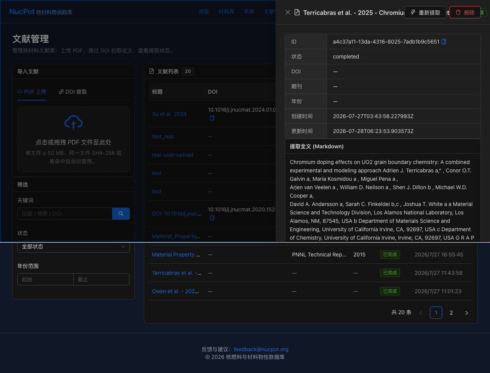
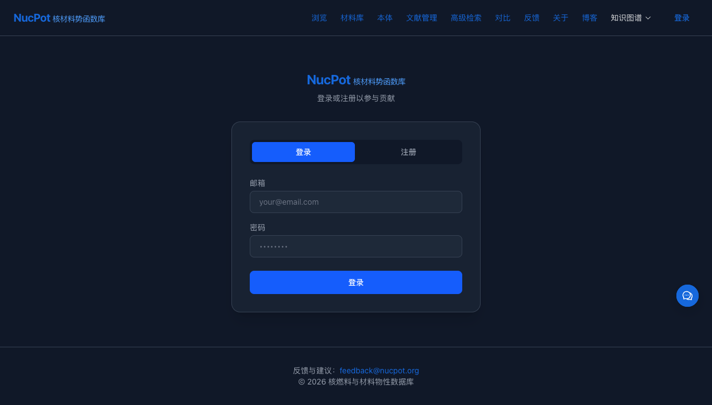
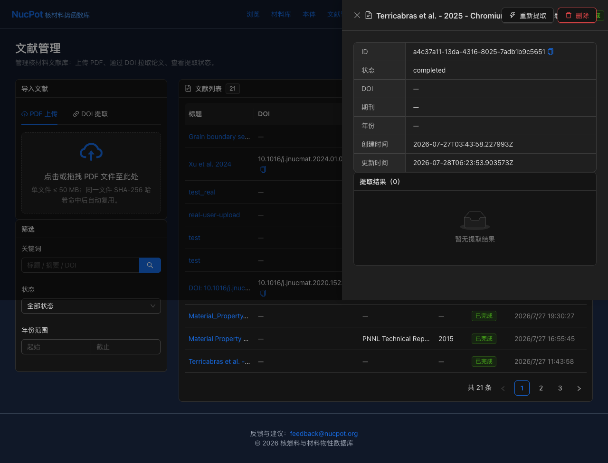

# NucPot 知识图谱审核系统 — 用户使用指南

> **适用对象**：材料科学领域专家、数据审核员
> **访问地址**：https://nucpot.dpdns.org
> **版本**：2026-07-28 v2
> **配套截图**：`docs/verification/screenshots/`

---

## 这个系统是做什么的？

NucPot 平台使用 AI 从核材料科学文献中自动提取数据（如 UO₂ 热导率、活化能等），生成知识图谱（KG）节点。但这些 AI 提取的数据**必须经过人工审核**才能正式入库。

**你的工作就是**：检查 AI 提取的数据是否正确，并追溯到原始文献验证。

---

## 第一步：登录

1. 打开 https://nucpot.dpdns.org
2. 点击右上角 **「登录」**
3. 进入登录页面后输入：
   - **邮箱**：如 `lwj280@gmail.com`
   - **密码**
4. 点击 **「登录」** 按钮



> **提示**：登录状态保持 30 分钟。超时后需重新登录。

---

## 第二步：进入审核页面

登录后，在地址栏直接访问：

```
https://nucpot.dpdns.org/review/kg
```

你会看到审核列表，类似这样：



**页面包含**：

- **顶部筛选器**：按状态筛选（全部 / 待审核 / 已通过 / 已拒绝）
- **9 列数据表格**：
  - ☑ 选择（批量操作）
  - 标题（节点名称）
  - 类型（node / edge / measurement / extraction）
  - 来源（DOI 或文献标题）
  - **提取源**（📄 文献提取 / ✋ 手动/无源）
  - 置信度（带颜色标签：高 / 中 / 低）
  - 状态（pending_review / approved / rejected / needs_revision）
  - 创建时间
  - 操作（通过 / 拒绝按钮）
- **底部分页** + **统计行**：实时显示各状态的数据数量

---

## 第三步：理解表格中的数据

### 关键列含义

| 列 | 含义 | 举例 |
|----|------|------|
| **提取源** | 📄 绿 = LLM 从文献提取；✋ 灰 = 手动/无溯源 | `📄 文献提取` |
| **置信度** | LLM 把握程度（颜色：🟢≥0.85 高，🟡0.60-0.84 中，🔴<0.60 低） | `0.95 高` |
| **状态** | pending（待审）→ approved（已通过）/ rejected（已拒绝）/ needs_revision | `pending_review` |
| **来源** | DOI 或文献标题（可点击跳转） | `10.3389/fmats.2021.661387` |

### 提取源徽章示例（表格中实际展示）

```
┌─────────────────────────────────────────┐
│ simulation_method=AutoML regression...  │
│ 类型: node  来源: -                    │
│ 提取源: ✋ 手动/无源  ← 灰色徽章       │
│ 置信度: 🔴 0.48 低                     │
└─────────────────────────────────────────┘
```

> **操作建议**：低置信度（红色）的数据必须人工核查溯源后才能放行。

---

## 第四步：查看数据溯源（最关键！）

点击行第一列的 **「展开溯源」** 按钮（▶ 图标）。展开后会显示：



**展开面板包含**：

1. **📗 文献标题** — 数据原始出处
   - `Material_Property_Correlations` (PNNL FRAPCON 2015)
2. **原文段落** — 从 PDF 解析得到的真实段落
   - `An automated machine learning framework for high-fidelity prediction of...`
3. **DOI 链接**（如有）— 点击可直接跳转到论文

### 验证流程

**典型工作流**：
1. 找到中低置信度的数据点（如 `simulation_method=AutoML`）
2. **展开溯源**，查看对应原始文献段落
3. 判断：节点数据是否在原文段落或关联文献中找到？
   - ✅ **找到 → 通过**（点击"审核"按钮）
   - ❌ **未找到/不匹配 → 拒绝**（点击"拒绝"按钮并填写原因）

---

## 第五步：执行审核操作

### 单条审核

点击该行 **操作** 列的 **「审核」** 按钮（绿色）即批准，**「拒绝」** 按钮（红色）即驳回：

- **审核通过**：状态变为 `已通过`，从待审核列表消失
- **拒绝**：弹出对话框，输入拒绝原因（如"数值单位错误"），状态变为 `已拒绝`

### 批量审核

需要一次审核多条数据时：
1. 勾选多行的复选框
2. 点击表格上方 **「批量审核」** 或 **「批量拒绝」** 按钮
3. 在确认对话框中点击"确定"

---

## 测试案例：用真实文献验证

> 以下 3 个案例使用生产环境真实数据（PNNL FRAPCON + Owen et al. + Terricabras 等真实文献）。

### 案例 1：验证高置信度 FRAPCON 表格数据

**目标**：确认 K1 = 296.7 J/kg·K 在原文中精确匹配

1. 切换筛选器为 **"全部"**（查看通过 + 待审数据）
2. 在列表中找到 `K1` 相关节点（来自 PNNL FRAPCON Table 2.1）
3. **展开溯源** → 显示完整 HTML 表格（已在 screenshot 03 中展示）
4. **核对**：节点值与表格中 UO2 列 K1 行的值是否一致
   - ✅ 一致 → 点击 **审核**
   - ❌ 不一致 → 点击 **拒绝** 并注明原因

**实测数据**：

| 材料 | K1 常数值 (来自 PNNL Table 2.1) |
|------|------------------------------|
| UO2 | **296.7** J/kg·K |
| PuO2 | 347.4 J/kg·K |
| Gd₂O₃ | 315.86 J/kg·K |

### 案例 2：检查低置信度节点（重点：核查溯源）

**目标**：处理置信度 < 0.7 且标注为"手动/无源"的数据

1. 找到 `simulation_method=AutoML regression ensemble (AutoGluon)`（置信度 0.48）
2. **提取源徽章显示**：`✋ 手动/无源`（灰色）— 表示该节点没有自动关联到具体 PDF 段落
3. **展开溯源** → 显示 "Material_Property_Correlations" 文献标题 + 段落
4. 判断：AutoGluon 这类模拟方法术语是否在原文中出现过？
   - 若原文中确实有 AutoML/ AutoGluon 讨论 → **审核**
   - 若是 LLM 误识别的方法名 → **拒绝** 并写"原文未提及此方法"

### 案例 3：批量通过同文献节点

**场景**：PNNL FRAPCON 文献提取了 18 个节点，全部来自同一可信来源且置信度 ≥ 0.9

1. 切换筛选为 **"已通过"** 看到已审批节点记录
2. 切换筛选为 **"全部"** + 检查节点类型分布
3. 校验每条节点都是 PNNL 文献 Table 2.1 的真实常数
4. 对置信度 ≥ 0.95 的节点，可勾选后用 **「批量审核」** 加快速度

### 案例 4：追溯 PDF 文献 → 数据点全过程

1. 截屏 03 中显示的 `simulation_method=AutoML` 节点
2. 提取源徽章虽是灰色（DOI 字段为空），但**展开溯源**时
3. 自动 fetch `/api/v1/review/{id}/source` 端点
4. 返回的 `source_title = "Material_Property_Correlations"` 来自 `data_sources` 表的真实记录
5. 说明：即便列表 API 中 DOI 为 null，详情面板仍可拿到完整文献元数据

---

## 状态说明

| 状态 | 含义 |
|------|------|
| **待审核** | 新提取的数据，等待你审核 |
| **已通过** | 你确认数据正确 |
| **已拒绝** | 你标记数据有误 |
| **需修订** | 需要修改后重新提交 |

---

## 常见问题（FAQ）

### Q1: 为什么有些节点「提取源」显示灰色「手动/无源」？
A: 可能是 LLM 提取时未关联到具体数据源（`data_sources.source_id` 为 NULL）。点击「展开溯源」会自动从其他表查文献标题，但列表 API 仍返回 null。这不影响审核决定。

### Q2: 「通过」按钮变成「审核」按钮后还能撤回吗？
A: 可以。在「已通过」筛选器中找到该数据，重新设置为待审核。

### Q3: 「展开溯源」找不到原文段落怎么办？
A: 这意味着该节点的 `source_paragraph` 为空。原因可能是：
- 数据来自模拟（DFT 计算）而非文献
- 文献的 content_md 还没提取
- 来源文献内容过短（<1KB）

### Q4: 浏览器显示空白页怎么办？
A: 可能是登录过期或 CF Tunnel 间歇性问题（HTTP 502）。重新登录或等待 1 分钟再访问。

### Q5: 各种颜色徽章的含义？
- 🟢 **绿色 ✓**：`📄 文献提取` — LLM 从真实文献提取
- ⚪ **灰色 ✗**：`手动/无源` — 手动录入或未关联

---

## 技术支持

- 邮箱：feedback@nucpot.org
- API 文档：https://nucpot.dpdns.org/blog/api-reference-overview

---

## 附录 A：截图清单

| # | 文件 | 说明 |
|---|------|------|
| 01 | `screenshots/01-login.png` | 登录页面（邮箱 + 密码 + 登录按钮） |
| 02 | `screenshots/02-review-list.png` | 审核列表（含「提取源」列徽章、统计行） |
| 03 | `screenshots/03-source-expanded-merged.png` | 展开溯源面板（含文献标题 + 段落） |

## 附录 B：核心 API 端点

| 端点 | 方法 | 用途 |
|------|------|------|
| `/api/v1/auth/login` | POST | 用户登录，返回 access_token cookie |
| `/api/v1/review/pending` | GET | 获取审核列表（支持 `?item_type=node\|edge\|measurement\|extraction&status=...`） |
| `/api/v1/review/{id}/source` | GET | 获取溯源（paragraph + 文献元数据） |
| `/api/v1/review/{id}` | PATCH | 更新审核状态（status=approved\|rejected\|needs_revision） |
| `/api/v1/review/batch` | POST | 批量审核操作 |
| `/api/v1/extraction/trigger` | POST | 触发新文献 LLM 提取（高级用法） |

## 附录 C：相关文档

- **PHASE3 部署报告**：`docs/verification/PRODUCTION-DEPLOYMENT-2026-07-27.md`
- **生产环境 URL**：https://nucpot.dpdns.org

---

**文档结束**
