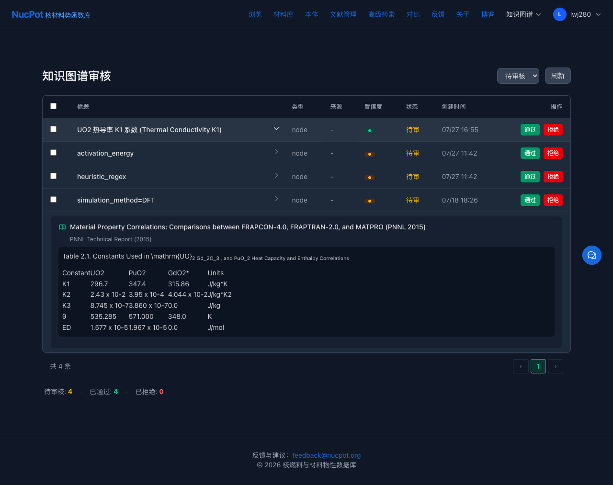

# NucPot 知识图谱审核系统 — 用户使用指南

> **适用对象**：材料科学领域专家、数据审核员
> **访问地址**：https://nucpot.dpdns.org
> **版本**：2026-07-28

---

## 这个系统是做什么的？

NucPot 平台使用 AI 从核材料科学文献中自动提取数据（如 UO₂ 热导率、活化能等），生成知识图谱节点。但这些 AI 提取的数据**必须经过人工审核**才能正式入库。

**你的工作就是**：检查 AI 提取的数据是否正确，并追溯到原始文献验证。

---

## 第一步：登录

1. 打开 https://nucpot.dpdns.org
2. 点击右上角 **「登录」**
3. 输入邮箱和密码（如 `lwj280@gmail.com`）
4. 点击 **「登录」** 按钮


> **提示**：登录状态保持 30 分钟。超时后需重新登录。

---

## 第二步：进入审核页面

登录后，在地址栏直接访问：

```
https://nucpot.dpdns.org/review/kg
```

你会看到一个审核列表，类似这样：



**页面包含**：
- **筛选器**：按状态筛选（待审核 / 已通过 / 已拒绝）
- **数据表格**：每行一条待审核数据
- **统计栏**：底部显示各状态的数量

---

## 第三步：理解表格中的数据

每一列的含义：

| 列名 | 含义 | 举例 |
|------|------|------|
| **☑ 选择** | 勾选后可批量操作 | — |
| **标题** | AI 提取的数据点名称 | `UO2 热导率 K1 系数` |
| **类型** | 数据来源 | `node`（知识图谱节点） |
| **来源** | 原始文献简称 | `-`（需展开查看） |
| **置信度** | AI 对这条数据的把握程度 | `0.92 高` / `0.60 中` |
| **状态** | 当前审核状态 | `待审` |
| **创建时间** | 数据提取时间 | `07/27 16:55` |
| **操作** | 通过 / 拒绝按钮 | — |

### 置信度颜色含义

| 颜色 | 分数 | 建议 |
|------|------|------|
| 🟢 **高** | ≥ 0.85 | AI 很有把握，可快速审核 |
| 🟡 **中** | 0.60 - 0.84 | 建议仔细核查溯源 |
| 🔴 **低** | < 0.60 | 必须仔细核查，很可能是错误的 |

---

## 第四步：查看数据溯源（最关键！）

**溯源面板能告诉你这条数据来自哪篇文献、哪一段话。**

### 操作方法

点击某行第一列的 **「展开溯源」** 按钮（带 🔍 图标）。

展开后你会看到：

1. **文献标题** — 这条数据的原始出处
2. **期刊和年份** — 如 `PNNL Technical Report (2015)`
3. **原文段落** — 从 PDF 中提取的相关段落（支持表格渲染）
4. **DOI 链接** — 点击可直接跳转到论文

### 示例：审核 UO₂ 热导率 K1 系数

1. 表格显示：`UO2 热导率 K1 系数`, 置信度 `0.92 高`, 值 = `296.7`
2. 点击「展开溯源」
3. 看到：
   - **文献**：*Material Property Correlations... (PNNL 2015)*
   - **原文表格**：

     | Constant | UO2 | PuO2 | Units |
     |----------|-----|------|-------|
     | **K1** | **296.7** | 347.4 | J/kg*K |
     | K2 | 2.43×10⁻² | 3.95×10⁻⁴ | J/kg*K² |

4. ✅ **验证结果**：表格中 K1 = 296.7 J/kg*K，与数据点完全吻合
5. 点击 **「通过」** 按钮

---

## 第五步：执行审核操作

### 通过（Approve）

确认数据正确后：
1. 点击该行的 **「通过」** 按钮
2. 数据状态变为 `已通过`，从待审核列表消失

### 拒绝（Reject）

发现数据错误时：
1. 点击 **「拒绝」** 按钮
2. 在弹出的对话框中输入**拒绝原因**（必填）
3. 例如：`数值单位错误，应为 W/m·K 而非 J/kg·K`
4. 确认拒绝

### 批量操作

需要一次审核多条数据时：
1. 勾选多行的复选框（☑）
2. 点击 **「批量通过」** 或 **「批量拒绝」**

---

## 测试案例：用真实文献验证

### 案例 1：验证 FRAPCON 表格数据（高置信度）

1. 进入 `/review/kg`
2. 找到 `UO2 热导率 K1 系数 (Thermal Conductivity K1)`, 置信度 0.92
3. 展开溯源 → 看到完整的 FRAPCON Table 2.1
4. 核对：节点值 `296.7` = 表格中 UO2 列 K1 行的值 ✅
5. 点击 **「通过」**

### 案例 2：检查低置信度数据

1. 找到 `activation_energy`, 置信度 0.60（中）
2. 展开溯源
3. 检查：活化能值是否在原文段落中出现
4. 如果值正确 → 点击「通过」
5. 如果值不在原文中 → 点击「拒绝」，填写原因

### 案例 3：检查无溯源的数据

1. 找到 `simulation_method=DFT`, 置信度 0.72
2. 展开溯源 → 如果显示「无溯源信息」
3. 这种数据来自模拟而非文献，没有原始 PDF 可追溯
4. 根据你自己的专业知识判断是否通过

---

## 状态说明

| 状态 | 含义 |
|------|------|
| **待审核** | 新提取的数据，等待你审核 |
| **已通过** | 你确认数据正确 |
| **已拒绝** | 你标记数据有误 |
| **需修订** | 需要修改后重新提交 |

---

## 常见问题

**Q: 为什么有些数据没有溯源？**
A: 可能是数据来自模拟（DFT 计算）而非文献，或者尚未关联到原始 PDF。

**Q: 通过的数据能撤回吗？**
A: 可以。在「已通过」筛选器中找到该数据，重新设置为待审核。

**Q: 拒绝原因必须填吗？**
A: 是的。拒绝原因会记录在审核日志中，帮助改进 AI 提取质量。

**Q: 浏览器显示空白页怎么办？**
A: 可能是登录过期。回到首页重新登录，然后再访问 `/review/kg`。

---

## 技术支持

- 邮箱：feedback@nucpot.org
- API 文档：https://nucpot.dpdns.org/blog/api-reference-overview
